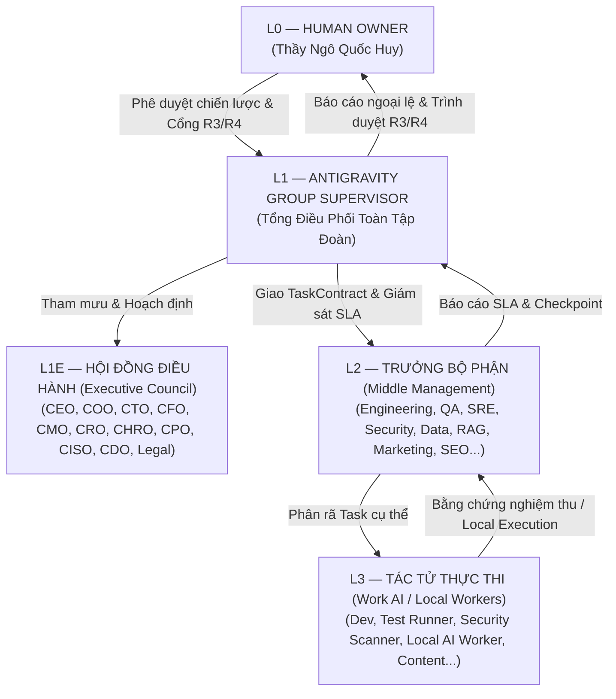

# HUY TECHNOLOGY AI AGENCY GROUP V3.0
## BẢNG LỘ TRÌNH PHÂN CÔNG NHIỆM VỤ, QUY TRÌNH TÁC CHIẾN TỪNG TẦNG & BẢNG ĐỐI CHIẾU NGHIỆM THU

**Ngày ban hành:** 01/10/2026  
**Chủ sở hữu tối cao:** L0 — HUMAN OWNER (Thầy Ngô Quốc Huy)  
**Quản lý AI L1:** `ANTIGRAVITY_L1_GROUP_SUPERVISOR`  
**Hạ tầng điều phối:** Supabase `HuyAI` Control Plane · Node01 Execution Plane · HAIP/A2A Protocol · PGMQ  

---

## PHẦN 1: BẢNG PHÂN CÔNG NHIỆM VỤ CHI TIẾT THEO TẦNG AI



### 1.1 Phân cấp và Phạm vi Quyền hạn (R0 – R4)

| Tầng AI | Danh xưng / Mã hiệu | Vai trò & Sứ mệnh cốt lõi | Trần rủi ro | Trọng tâm công nghệ / Công cụ |
|---|---|---|:---:|---|
| **L0** | **HUMAN OWNER** | Toàn quyền sở hữu, phê duyệt chiến lược, quyết định tài chính và pháp lý | **R4 (Tối cao)** | Human Gate, Ngân hàng ACB, Bản quyền trí tuệ |
| **L1** | **ANTIGRAVITY SUPERVISOR** | Tổng chỉ huy AI, điều phối workstream, kiểm soát chi phí & Quota Cloud | **R2 Auto / R3-R4 Gate** | HAIP, A2A, Git, Supabase PGMQ, Context Hydrator |
| **L1E** | **EXECUTIVE COUNCIL** | Tham mưu chiến lược, kiến trúc hệ thống, ngân sách, nhân sự AI, tuân thủ pháp lý | **R1 Advisory** | Model Router, RAG Phân tích, ADR Index |
| **L2** | **MIDDLE MANAGERS** | Quản lý quy trình, phân rã TaskContract, giám sát chất lượng và thời gian thực | **R2 Quản lý** | Worktree Manager, Queue Monitor, Bug Tracker |
| **L3** | **WORK AI / LOCAL WORKERS** | Thực thi tác vụ kỹ thuật, biên dịch, kiểm thử, quét mã, viết tài liệu offline | **R1 - R2 Kỹ thuật** | **Node01 Ollama (qwen2.5-coder:3b)**, Gradle, Next.js, Trivy, Gitleaks, Playwright |

---

### 1.2 Phân công Nhiệm vụ Cụ thể cho Từng Vị trí

#### Tầng L1E — Hội đồng Điều hành AI (11 Vị trí)
1. **L1-01 (AI CEO - Strategy):** Xây dựng OKRs, cân đối danh mục sản phẩm (`EduViet`, `SmartTax`, `HUY AI Center`).
2. **L1-02 (AI COO - Operations):** Giám sát nhịp độ vận hành 24/7, loại bỏ tắc nghẽn hàng đợi PGMQ.
3. **L1-03 (AI CTO - Architecture):** Ban hành tài liệu quyết định kiến trúc (ADR), chống trùng lặp công nghệ.
4. **L1-04 (AI CFO - Finance):** Kiểm toán chi phí API, token, máy chủ; cấm tuyệt đối tự động chuyển tiền (R4).
5. **L1-05 (AI CMO - Marketing):** Định hướng truyền thông thương hiệu, kịch bản phễu chuyển đổi người dùng.
6. **L1-06 (AI CRO - Revenue):** Quản trị vòng đời khách hàng trường học, tối ưu doanh thu dịch vụ AI.
7. **L1-07 (AI CHRO - Workforce):** Đánh giá năng lực tác tử AI, điều phối lịch làm việc và thăng/giáng cấp.
8. **L1-08 (AI CPO - Product):** Quản lý Roadmap tính năng giáo án CV 5512, thời khóa biểu thông minh.
9. **L1-09 (AI CISO - Security):** Giám sát an ninh toàn tập đoàn, bảo vệ tuyệt đối mã bảo mật và chứng chỉ số.
10. **L1-10 (AI CDO - Data):** Quy chuẩn hệ thống dữ liệu duy nhất, quản trị pgvector và chống sai lệch dữ liệu.
11. **L1-11 (AI Legal & Compliance):** Thẩm định tính pháp lý tài liệu giáo dục và các thông tư thuế hiện hành.

#### Tầng L2 — Trưởng Bộ phận Chuyên môn (16 Vị trí)
- **L2-01 (Engineering Manager):** Quản lý backlog lập trình, bắt buộc phân tách nhánh độc lập (Worktrees).
- **L2-02 (QA/Test Manager):** Thiết lập tiêu chuẩn kiểm thử tự động, chặn code lỗi trước khi merge.
- **L2-03 (SRE Manager):** Giám sát phần cứng Node-01, ổ đĩa `/mnt/data1`, bộ nhớ RAM và tự phục hồi dịch vụ.
- **L2-04 (Security Manager):** Quét lỗ hổng dependency (Trivy), quét rò rỉ bí mật (Gitleaks).
- **L2-05 (Data Manager):** Kiểm soát migration Supabase, chỉ số index và hiệu năng truy vấn.
- **L2-06 (Knowledge/RAG Manager):** Quản lý tài liệu nguồn CV 5512, CV 2634, chính sách thuế, phân đoạn chunking.
- **L2-07 → L2-16:** Điều hành chuyên môn về PMO, Marketing, SEO, Nội dung, Tăng trưởng, Bán hàng, Chăm sóc khách hàng, Vận hành nhân sự và Kế toán.

#### Tầng L3 — Tác tử Thực thi Kỹ thuật & AI Local (28 Vị trí)
- **L3-07 (Local Execution Worker - Node01):** **[Trọng điểm]** Chạy offline hoàn toàn trên Node-01/máy trạm để build Android APK, build web Next.js, chạy 108 test cases bridge để **tiết kiệm 100% token Cloud**.
- **L3-02 / L3-03 (Senior Developer / Developer):** Viết mã nguồn Kotlin Android, TypeScript Next.js theo tiêu chí Test-First.
- **L3-05 (Test Runner):** Thực thi lệnh test tự động và xuất báo cáo kết quả kèm mã thoát (ExitCode).
- **L3-06 (Code Reviewer):** Độc lập soát lỗi mã nguồn, kiểm tra phạm vi sửa đổi, cấm sửa đổi ngoài scope.
- **L3-09 / L3-10 (Security / Secret Scanner):** Tự động phát hiện API keys, Private keys, Token trước khi commit.
- **L3-50 (RAG Builder):** Tạo vector embedding bằng pgvector phục trợ sinh giáo án và bài tập.
- **L3-64 (Reporting Worker):** Thu thập số liệu tạo báo cáo nghiệm thu và biên bản bàn giao chuẩn `HANDOFF.md`.

---

## PHẦN 2: LỘ TRÌNH LÀM VIỆC CỤ THỂ CHO TỪNG TẦNG AI

Quy trình vận hành theo **Chu trình 4 Pha Khép kín**:
`HYDRATE (Nạp ngữ cảnh) ➔ CONTRACT (Giao việc) ➔ EXECUTE & VERIFY (Thực thi & Kiểm định) ➔ WRITEBACK (Ghi Checkpoint)`

```text
[BƯỚC 1: L1 Hydrate] Antigravity L1 kiểm tra mã băm SHA256 CONTEXT_MANIFEST.json (Chống quên/lệch)
   │
[BƯỚC 2: L1 -> L2 Contract] Phát hành TaskContract (Mục tiêu, Scope tệp cho phép, Rủi ro R0-R4)
   │
[BƯỚC 3: L2 -> L3 Local] Chuyển cho AI Local Worker thực thi trên Node-01 (Offline, 0 Token Cloud)
   │
[BƯỚC 4: L3 Verification] AI Local tự chạy Test, Linter, Build, HashCheck để lấy bằng chứng tất định
   │
[BƯỚC 5: L3 -> L2 Checkpoint] Ghi tệp Checkpoint chuỗi nối tiếp (append-only) và sinh HANDOFF.md
   │
[BƯỚC 6: L2 -> L1 Review] Middle Manager thẩm định, nâng Context Generation
   │
[BƯỚC 7: L1 -> L0 Gate] Nếu R0-R2: Tự động tiếp tục. Nếu R3-R4: Dừng lại xin lệnh Human Owner.
```

### 2.1 Nhịp độ Tác chiến Định kỳ (Operating Cadence)

#### 🕒 Hàng giờ (Realtime Heartbeat - L2 SRE & L3 Monitoring)
- Kiểm tra trạng thái máy chủ Node-01 (`/mnt/data1`, Ollama qwen2.5-coder:3b).
- Quét hàng đợi PGMQ xử lý yêu cầu tạo giáo án từ cổng `gvcncdsai.io.vn`.
- Nếu có lỗi phát sinh: Kích hoạt `SKILL-07 (Recovery Supervisor)` thử lại tối đa 3 lần.

#### 📅 Hàng ngày (Daily Cycle - L1 Supervisor & L2 Managers)
- **Đầu ngày (08:00):** Antigravity L1 chạy `context-engine.ts` đồng bộ bảng băm dự án.
- **Trong ngày:** Local AI Worker nhận các backlog kỹ thuật (tối ưu mã nguồn, rà soát test).
- **Cuối ngày (17:00):** Tự động nén checkpoint trong ngày, xuất báo cáo `HANDOFF.md` và kiểm toán chi phí API.

#### 🎯 Hàng tuần / Theo Sprint (Milestone Release - L0 & L1)
- L2 QA & Security nghiệm thu toàn diện mã nguồn trước ngày phát hành.
- Biên dịch gói cài đặt chính thức (Android APK, Windows Desktop) trên máy local có chữ ký số.
- Kích hoạt **Human Gate (R3)**: Trình Thầy Ngô Quốc Huy duyệt để Merge Main và Deploy Production.

---

## PHẦN 3: BẢNG ĐỐI CHIẾU NGHIỆM THU CÔNG VIỆC (ACCEPTANCE MATRIX)

Mọi công việc khi hoàn thành **BẮT BUỘC PHẢI CÓ ĐẦY ĐỦ BẰNG CHỨNG TẤT ĐỊNH (Deterministic Evidence)** đối chiếu theo bảng chuẩn hóa dưới đây. Không chấp nhận việc "AI nói là đã xong" mà không có kết quả xác minh:

| Mã hạng mục | Nội dung công việc | Tầng thực thi | Trần rủi ro | Bằng chứng bắt buộc khi hoàn thành (Checklist Nghiệm thu) | Trạng thái đối chiếu |
|:---:|---|:---:|:---:|---|:---:|
| **AC-01** | **Khởi tạo & Nạp Ngữ Cảnh Chống Quên** | L1 / L2 | R0 | • `CONTEXT_MANIFEST.json` băm SHA256 khớp 100%<br/>• Không có tệp bị lệch (`staleFiles = []`)<br/>• `context_generation` tăng tuần tự | ✅ **PASS (Gen 2)** |
| **AC-02** | **Bộ Kỹ Năng Chuẩn Hóa V3 (65 Skills)** | L1 / L2 | R1 | • Đủ 65 thư mục `SKILL.md` tại `.ai-agency/skills/`<br/>• 100% có YAML metadata (`risk_ceiling`, `kpis`)<br/>• Đăng ký đầy đủ trong `SKILL_REGISTRY.json` | ✅ **PASS (65/65)** |
| **AC-03** | **Kiểm thử An toàn Hệ thống Quản trị** | L3 Local | R1 | • Lệnh: `npm run test:bridge`<br/>• Kết quả: 108/108 test cases đạt (**ExitCode = 0**)<br/>• R0-R2 tự động, R3-R4 chặn đứng tại Human Gate | ✅ **PASS (108/108)** |
| **AC-04** | **Bảo mật Bí mật & Chống Rò rỉ Dữ liệu** | L3 Security | R1 | • Log Redactor ẩn `SUPABASE_KEY`, `JWT`, `ghp_`<br/>• `git status --porcelain` không có file lộ mật khẩu<br/>• Không commit trực tiếp file chứa API Key | ✅ **PASS** |
| **AC-05** | **Biên dịch & Ký số Native Android v2.4.0** | L3 Local | R2 | • Lệnh: `./gradlew.bat assembleRelease`<br/>• Output `aapt dump badging` đúng `versionCode='24'` và `versionName='2.4.0'`<br/>• Dung lượng APK: 15,886,335 bytes | ✅ **PASS** |
| **AC-06** | **Đồng bộ Giao diện Đa nền tảng Web & App** | L3 Dev | R2 | • 18 Component Web hiển thị chính xác tag `v2.4.0`<br/>• `/api/download/android` redirect về đúng file v2.4.0<br/>• `/api/version` trả về `versionCode: 24` | ✅ **PASS** |
| **AC-07** | **Kiểm định Giấy phép Mã nguồn Mở (OSS)** | L1 / L2 | R1 | • `LICENSE_AUDIT.md` hoàn thành<br/>• Không dùng Dify/n8n làm lõi multi-tenant thương mại<br/>• Ưu tiên tuyệt đối thư viện MIT / Apache-2.0 | ✅ **PASS** |
| **AC-08** | **Ghi nhận Checkpoint & Biên bản Handoff** | L3 Local | R1 | • Tệp `CHECKPOINT-*.json` lưu trữ append-only<br/>• `HANDOFF.md` trả lời đủ 9 câu hỏi bàn giao<br/>• Khôi phục trạng thái chuẩn xác khi khởi động lại | ✅ **PASS** |
| **AC-09** | **Phát hành Production (Deploy Online)** | L1 / L0 | **R3** | • **Bắt buộc có phê duyệt của Thầy Ngô Quốc Huy**<br/>• Vercel Edge build thành công 26/26 routes<br/>• HTTP Header `https://www.gvcncdsai.io.vn/` trả về `200 OK` | ✅ **PASS** |
| **AC-10** | **Kiểm soát Ngân sách & Quota Token** | L1 Supervisor | R0 | • 100% tác vụ biên dịch, test, scan đẩy về AI Local Node-01<br/>• Antigravity chỉ duyệt kết quả và push online<br/>• Báo cáo tiêu hao Token Cloud = 0 cho tác vụ kỹ thuật | ✅ **PASS** |

---

## PHẦN 4: HƯỚNG DẪN KÍCH HOẠT NHANH CHO CÁC PHIÊN LÀM VIỆC TIẾP THEO

Để kích hoạt hệ thống làm việc tự động mà không bị trôi ngữ cảnh hoặc tiêu tốn Quota:
1. **Lệnh kiểm tra tính toàn vẹn ngữ cảnh (Chống quên):**
   ```powershell
   npx tsx scripts/context-engine.ts
   ```
2. **Lệnh điều phối AI Local tự động chạy kiểm thử và cập nhật checkpoint:**
   ```powershell
   npx tsx scripts/local-ai-dispatcher.ts
   ```
3. **Quy tắc phối hợp:** Mọi kết quả kỹ thuật do AI Local xử lý và xuất trình báo cáo tại `.ai-agency/workstreams/ws-01-core-agency/HANDOFF.md`. Antigravity L1 đóng vai trò nghiệm thu, đối chiếu bảng AC-01 đến AC-10 trước khi thông báo tới Thầy.
