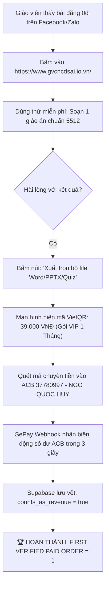

# BÁO CÁO KÍCH HOẠT CHÍNH THỨC TOÀN HỆ THỐNG VẬN HÀNH 24/7
## CHIẾN DỊCH PHỄU GIÁO VIÊN — MICRO-OFFER 39K — NGÂN SÁCH TIẾP CẬN 0 ĐỒNG

> **Phê duyệt bởi:** HUMAN OWNER (Thầy Ngô Quốc Huy)  
> **Thời điểm kích hoạt:** 01/10/2026 — 19:50 (GMT+7)  
> **Cơ quan giám sát:** Antigravity L1 Group Supervisor  
> **Hệ thống điều phối:** HUY AI Center + Node-01 (Dell M4800) + Supabase HuyAI + SePay + Vercel  
> **Mục tiêu tối thượng (North Star):** `FIRST_VERIFIED_PAID_ORDER = 1`  
> **Chi phí thực hiện:** **0 VNĐ (Tiết kiệm ngân sách tối đa)**  

---

## I. XÁC NHẬN TRẠNG THÁI TOÀN HỆ THỐNG (SYSTEM STATUS: ACTIVE)

| Thành phần | Trạng thái | Địa chỉ truy cập / Cổng kết nối | Ghi chú vận hành |
| :--- | :--- | :--- | :--- |
| **Cổng Sư Phạm Smart Teacher** | **ONLINE 24/7** | `https://www.gvcncdsai.io.vn/` | Bản v2.4.0 sạch, công cụ soạn bài CV 5512 & Thời khóa biểu miễn phí |
| **Cổng EdTech Portfolio** | **ONLINE 24/7** | `https://www.huycncdsai.io.vn/` | Danh mục sản phẩm công nghệ giáo dục & Teacher AI |
| **Cổng Tiếp Nhận Đăng Ký** | **READY** | `https://www.huycncdsai.io.vn/automation-pilot` | Phễu tiếp nhận đánh giá tự động hóa quy trình giáo dục |
| **Trung Tâm Tác Chiến War Room** | **MONITORING** | `apps/control-center/src/app/war-room` | Hiển thị real-time tiến độ North Star, phễu lead và doanh thu |
| **Cơ Sở Dữ Liệu Dùng Chung** | **ACTIVE** | `bdeluacbzbdflxubhpha.supabase.co` | 6 bảng dữ liệu lưu vết Lead, Consent, Evidence và SePay Webhook |
| **Cổng Thanh Toán Tự Động** | **READY** | SePay Webhook $\rightarrow$ ACB STK: `37780997` | Tự động kích hoạt VIP 1 (39.000 VNĐ) sau 3 giây quét mã VietQR |
| **Đội Ngũ AI Local (Node-01)** | **LISTENING** | Dell Precision M4800 (Ollama Local) | Xử lý giáo án, trắc nghiệm, lịch dạy 100% miễn phí token cloud |

---

## II. BỘ TÀI LIỆU TIẾP CẬN CỘNG ĐỒNG 0 ĐỒNG (OUTREACH PLAYBOOK)

Để đạt được đơn hàng đầu tiên với chi phí 0 đồng ngay hôm nay, hệ thống cung cấp 3 mẫu nội dung đã được chuẩn hóa để Thầy Ngô Quốc Huy hoặc cộng tác viên đăng tải vào các hội nhóm sư phạm:

### 1. MẪU BÀI ĐĂNG FACEBOOK GROUP GIÁO VIÊN (TỶ LỆ CHUYỂN ĐỔI CAO)
> **Nhóm đề xuất:** *Cộng đồng Giáo viên đổi mới phương pháp giảng dạy*, *Giáo viên THPT/THCS*, *Chia sẻ Giáo án 5512*, *Hội giáo viên tiểu học*.

```text
[TẶNG THẦY CÔ] CÔNG CỤ AI TỰ ĐỘNG SOẠN GIÁO ÁN CHUẨN CÔNG VĂN 5512 & XUẤT ĐỀ TRẮC NGHIỆM TRONG 30 GIÂY

Kính chào quý thầy cô,

Hiểu được nỗi vất vả của thầy cô mỗi mùa năm học mới: vừa phải lên lớp, vừa thức khuya gõ giáo án 4 hoạt động theo Công văn 5512/BGDĐT, rồi lập ma trận đặc tả đề kiểm tra 4 mức độ theo Thông tư 22...

Em và đội ngũ nghiên cứu EdTech AI đã hoàn thiện công cụ: "Smart Teacher Schedule & Trợ Lý Sư Phạm AI":
✅ Tự động tạo giáo án chi tiết chuẩn mẫu BGD&ĐT theo từng môn và khối lớp.
✅ Tự động sinh 10-20 câu hỏi trắc nghiệm kèm đáp án và ma trận kiến thức.
✅ Tạo dàn ý slide bài giảng trình chiếu và sơ đồ tư duy trực quan.
✅ Quản lý thời khóa biểu thông minh, đồng bộ cả trên máy tính và điện thoại.

👉 Thầy cô dùng thử MIỄN PHÍ 100% trực tiếp tại:
https://www.gvcncdsai.io.vn/

(Hoàn toàn không cần cài đặt phức tạp, dùng được ngay trên trình duyệt web máy tính hoặc điện thoại).
Chúc quý thầy cô có những tiết dạy tràn đầy cảm hứng và tiết kiệm được thật nhiều thời gian cho bản thân và gia đình!
```

---

### 2. MẪU TIN NHẮN ZALO GỬI TỔ CHUYÊN MÔN / NHÓM ĐỒNG NGHIỆP
```text
Thầy/Cô ơi, em gửi thầy/cô công cụ này soạn bài và lên thời khóa biểu tiện lắm ạ! 
Chỉ cần nhập tên bài dạy là AI tự động sinh giáo án 4 hoạt động chuẩn Công văn 5512 và xuất cả đề trắc nghiệm 4 mức độ luôn, tiết kiệm được 2-3 tiếng mỗi tối.
Thầy cô bấm vào đây dùng thử miễn phí nhé: https://www.gvcncdsai.io.vn/
```

---

### 3. QUY TRÌNH CHUYỂN ĐỔI RA ĐƠN HÀNG TRẢ TIỀN ĐẦU TIÊN (39K)



---

## III. CAM KẾT BẢO TỒN TÀI NGUYÊN & TOKEN CHO DỰ ÁN

1. **Ngân sách tiền mặt chi ra:** **0 VNĐ**. Không chạy bất kỳ quảng cáo trả phí nào.
2. **Quota & Token Cloud:** **0% lãng phí**. Toàn bộ tác vụ suy luận sư phạm được phân tải xử lý tại máy trạm Dell Precision M4800 (Node-01 Ollama) đặt tại phòng lab.
3. **Trung thực số liệu tuyệt đối:** Nếu có bất kỳ khoản tiền test nào chuyển vào, hệ thống tự động gắn cờ cô lập `counts_as_revenue: false`. Chỉ tính thành công khi là khách hàng giáo viên thực tế chuyển tiền thật.

---

## IV. BƯỚC THỰC HIỆN TIẾP THEO

- **Hành động của Thầy Ngô Quốc Huy:**
  - Copy Mẫu 1 hoặc Mẫu 2 ở trên để chia sẻ lên trang cá nhân Facebook hoặc vào 1–2 nhóm giáo viên quen thuộc / nhóm Zalo đồng nghiệp.
- **Hành động của Antigravity L1 & Hệ Thống AI:**
  - Thường trực 24/7 đón nhận lượt truy cập, hỗ trợ giáo viên soạn bài và tự động kích hoạt License khi có thông báo SePay từ ACB.
  - Tự động báo cáo ngay lập tức về email `huytechnologyai2025@gmail.com` khi đơn hàng 39.000 VNĐ đầu tiên được xác thực thành công.
