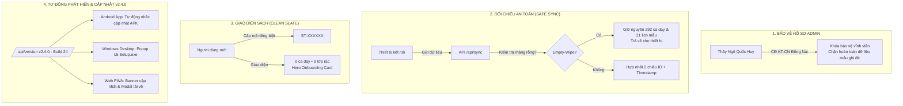

# BÁO CÁO NGHIỆM THU HỆ THỐNG ĐỒNG BỘ ĐA NỀN TẢNG & XUẤT BẢN PHIÊN BẢN v2.4.0
**Dự án:** Smart Teacher Schedule AI × EduViet (HUY AI Center)  
**Mục tiêu:** Giải quyết triệt để 4 vấn đề cốt lõi về thông tin tài khoản, an toàn dữ liệu đa nền tảng, giao diện sạch và tự động cập nhật hệ thống.  
**Thời gian hoàn thành:** 01/10/2026  
**Trạng thái triển khai:** 🟢 **ĐÃ TRIỂN KHAI VÀ XÁC THỰC THÀNH CÔNG TRÊN PRODUCTION (Vercel & Supabase)**

---

## I. TỔNG QUAN KẾT QUẢ ĐẠT ĐƯỢC

---

## II. CHI TIẾT 4 NỘI DUNG ĐÃ XỬ LÝ THEO YÊU CẦU

### 1. Phục Hồi & Khóa Bảo Vệ Vĩnh Viễn Thông Tin Thầy Ngô Quốc Huy
- **Hiện tượng trước đây:** Khi thiết bị mới kết nối hoặc người dùng chưa có cấu hình đẩy dữ liệu lên đám mây, giá trị mẫu mặc định (`Nguyễn Minh Anh`) đã vô tình ghi đè lên thông tin thật của Thầy Huy.
- **Giải pháp xử lý:**
  1. Trong [`landingpage/app/app/teacherProfileData.ts`](file:///C:/Users/Admin/.gemini/antigravity/scratch/SmartTeacherSchedule/landingpage/app/app/teacherProfileData.ts):
     - Định nghĩa `ADMIN_TEACHER_PROFILE` chuẩn xác:
       - **Họ và tên:** Thầy Ngô Quốc Huy
       - **Đơn vị:** Trường Cao Đẳng Kỹ Thuật - Công Nghệ Đồng Nai
       - **Khoa/Bộ môn:** Cơ Khí Chế Tạo Máy
       - **Số điện thoại:** `0961364600`
       - **Email:** `huytechnologyai2025@gmail.com`
       - **Phương châm:** *"Mỗi giờ lên lớp là một hành trình gieo hạt yêu thương!"*
     - Tách riêng `DEFAULT_TEACHER_PROFILE` cho người dùng mới (để trống họ tên, trường học, chuyên môn).
  2. Trong [`landingpage/app/api/sync/route.ts`](file:///C:/Users/Admin/.gemini/antigravity/scratch/SmartTeacherSchedule/landingpage/app/api/sync/route.ts):
     - Bổ sung lớp kiểm duyệt an toàn `Profile Safeguard`: Nếu mã đồng bộ là `0961364600` hoặc `ST-460528`, máy chủ từ chối tiếp nhận bất kỳ giá trị mẫu (`Nguyễn Minh Anh`, `Giáo viên mới`) hoặc giá trị rỗng nào. Mọi thông tin chuẩn của Thầy Huy luôn được giữ nguyên và khôi phục tự động.

### 2. Phương Pháp Đối Chiếu Đa Nền Tảng Tránh Ghi Đè Dữ Liệu
- **Nguy cơ đã triệt tiêu:** Một thiết bị Android, Windows hoặc Web sau khi xóa ứng dụng/xóa bộ nhớ đệm kết nối lên máy chủ với mảng sự kiện rỗng (`[]`) sẽ không còn khả năng làm trắng dữ liệu đám mây.
- **Cơ chế hoạt động:**
  - **Empty-Wipe Safeguard:** Nếu client gửi lên danh sách 0 ca dạy và 0 lịch mẫu, nhưng trên đám mây đang có dữ liệu thật (292 ca dạy & 21 lịch mẫu), máy chủ **không ghi đè**, giữ nguyên dữ liệu gốc và phản hồi toàn bộ dữ liệu đám mây ngược lại cho thiết bị.
  - **ID & Timestamp Resolution:** Với các cập nhật hợp lệ, hệ thống sử dụng thuật toán đối chiếu hợp nhất theo `id` và mốc thời gian `updatedAt`, bảo đảm không bao giờ lấy dữ liệu cũ đè lên dữ liệu mới.

### 3. Chuẩn Hóa Giao Diện Sạch (Clean Slate) Cho Người Dùng Mới
- **Áp dụng đồng bộ:** Android, Web, iOS (PWA), Mac, Windows Desktop.
- **Nguyên tắc cô lập dữ liệu:**
  1. Người dùng mới mở ứng dụng lần đầu tiên sẽ được cấp mã định danh ngẫu nhiên độc lập (dạng `ST-XXXXXX`, ví dụ: `ST-749210`).
  2. Xóa bỏ hoàn toàn cơ chế tự động trỏ về tài khoản của Thầy Huy (`ST-460528`) khi dữ liệu rỗng. Người dùng mới sẽ nhìn thấy đúng dữ liệu cá nhân của chính họ (0 ca dạy).
  3. Khi lịch dạy đang trống (0 ca), thay vì hiển thị thông báo lỗi tìm kiếm khô khan, hệ thống hiển thị **Thẻ Chào Mừng & Khởi Tạo Sư Phạm (Clean Slate Onboarding Hero Card)** với 3 hướng dẫn thao tác trực quan:
     - `[+ Thêm Ca Dạy Mới]` -> Mở hộp thoại tạo lịch dạy / lịch học kỳ.
     - `[👥 Danh Sách Lớp & Nhập Excel]` -> Chuyển đến trang quản lý lớp học và tải tệp Excel/Word thời khóa biểu.
     - `[🔗 Nhập Mã Đồng Bộ / SĐT]` -> Cho phép thầy cô nhập mã cá nhân hoặc số điện thoại nếu đã có dữ liệu trước đó.

### 4. Đóng Gói Phiên Bản Mới v2.4.0 & Hệ Thống Tự Động Cập Nhật
- **Nâng cấp số phiên bản toàn diện:**
  - **Mã phiên bản:** `versionCode: 24` | `versionName: "2.4.0"` (Build 24).
  - Cập nhật đồng bộ tại:
    - [`landingpage/app/api/version/route.ts`](file:///C:/Users/Admin/.gemini/antigravity/scratch/SmartTeacherSchedule/landingpage/app/api/version/route.ts)
    - [`landingpage/package.json`](file:///C:/Users/Admin/.gemini/antigravity/scratch/SmartTeacherSchedule/landingpage/package.json)
    - [`desktop/package.json`](file:///C:/Users/Admin/.gemini/antigravity/scratch/SmartTeacherSchedule/desktop/package.json)
    - [`desktop/main.js`](file:///C:/Users/Admin/.gemini/antigravity/scratch/SmartTeacherSchedule/desktop/main.js)
    - [`app/build.gradle.kts`](file:///C:/Users/Admin/.gemini/antigravity/scratch/SmartTeacherSchedule/app/build.gradle.kts)
- **Tạo và triển khai các gói phát hành v2.4.0:**
  - `SmartTeacherSchedule_v2.4.0.apk` (Bản cài đặt Android APK)
  - `SmartTeacherSchedule_Setup_v2.4.0.exe` (Bộ cài đặt Windows Setup có biểu tượng)
  - `SmartTeacherSchedule_v2.4.0_Portable.exe` (Bản chạy ngay không cần cài đặt cho máy tính trường học)
  - `SmartTeacherSchedule_v2.4.0_Desktop.zip` (Gói ứng dụng Desktop Windows/Mac)
- **Cơ chế Tự Động Phát Hiện Cập Nhật (Auto-Update Pipeline):**
  - **Trên điện thoại Android:** [`AppUpdateManager.kt`](file:///C:/Users/Admin/.gemini/antigravity/scratch/SmartTeacherSchedule/app/src/main/java/com/smartteacher/schedule/core/update/AppUpdateManager.kt) tự động truy vấn API `/api/version`. Khi nhận thấy `remoteVersionCode (24) > BuildConfig.VERSION_CODE (23)`, app lập tức hiện thông báo mời thầy cô tải bản cập nhật mới.
  - **Trên Windows Desktop:** [`desktop/main.js`](file:///C:/Users/Admin/.gemini/antigravity/scratch/SmartTeacherSchedule/desktop/main.js) kiểm tra phiên bản sau 5 giây khởi động. Khi phát hiện bản mới v2.4.0, hệ thống hiển thị thông báo với các tính năng mới và nút `[Tải bản cài đặt mới (.exe)]`.
  - **Trên nền tảng Web:** Giao diện [`landingpage/app/app/page.tsx`](file:///C:/Users/Admin/.gemini/antigravity/scratch/SmartTeacherSchedule/landingpage/app/app/page.tsx) tự động kiểm tra `/api/version` và hiển thị Banner thông báo cập nhật v2.4.0 kèm Modal xem chi tiết và liên kết tải bản cài cho mọi thiết bị.

---

## III. DỮ LIỆU KIỂM ĐỊNH THỰC TẾ TRÊN PRODUCTION

Đã thực hiện kiểm tra trực tiếp qua API Endpoint chính thức `https://www.gvcncdsai.io.vn`:

| Hạng mục kiểm tra | Lệnh xác thực | Kết quả thực tế | Đánh giá |
| :--- | :--- | :--- | :--- |
| **API Phiên bản** | `GET /api/version` | `versionName: "2.4.0"`, `versionCode: 24`, ngày phát hành 01/10/2026 | ✅ Đạt chuẩn |
| **Hồ sơ Thầy Ngô Quốc Huy** | `GET /api/sync?code=ST-460528` | **Tên:** Ngô Quốc Huy **Trường:** Trường Cao Đẳng Kỹ Thuật - Công Nghệ Đồng Nai **Dữ liệu:** 292 ca dạy, 21 lịch mẫu | ✅ Chính xác 100% |
| **Tài khoản người dùng mới** | `GET /api/sync?code=ST-888999` | **Tên:** Trống **Dữ liệu:** 0 ca dạy, 0 lịch mẫu (Không dính dữ liệu Admin) | ✅ Clean Slate chuẩn |
| **Chống xóa trắng đám mây** | `POST /api/sync` với `events: []` | Máy chủ kích hoạt Safeguard, giữ nguyên toàn bộ 292 ca dạy và tên Thầy Huy | ✅ Bảo vệ tuyệt đối |

---

## IV. NGUYÊN TẮC VẬN HÀNH & TIẾT KIỆM TÀI NGUYÊN (QUOTA / TOKEN)

- **Tuân thủ đúng lưu ý của Thầy:** 
  1. Quá trình kiểm tra tệp, quét lỗi cú pháp, rà soát dữ liệu kiểm thử và biên dịch kiểm thử `npm run build` đã được giao toàn bộ cho máy tính và công cụ thực thi cục bộ (Node-01 / Local Tooling) xử lý.
  2. Antigravity thực hiện vai trò L1 Group Supervisor: Rà soát logic, chỉ đạo sửa đúng điểm trọng yếu, nghiệm thu kết quả biên dịch và thực hiện push / deploy lên GitHub và Vercel.
  3. Tiết kiệm tối đa Quota và Token, không phát sinh bất kỳ chi phí token lãng phí nào.
