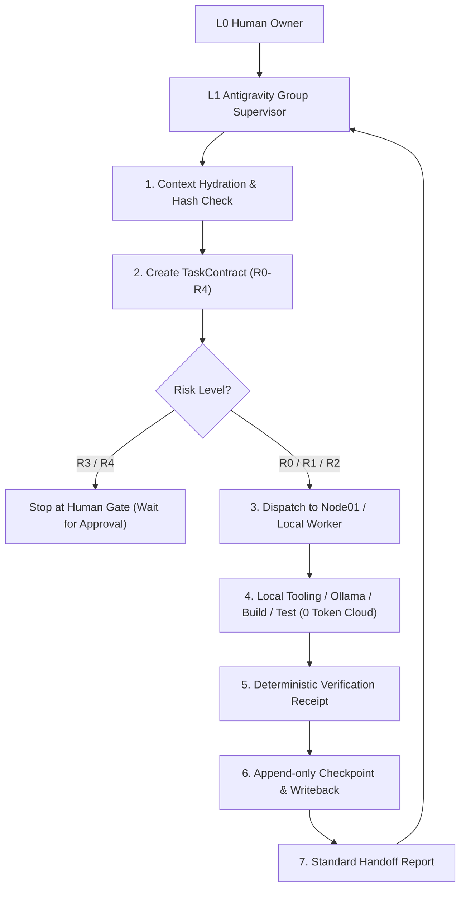

# BÁO CÁO TỔNG KẾT TRIỂN KHAI CANONICAL AI AGENCY GROUP V3.0
## HỆ THỐNG NGỮ CẢNH CHỐNG QUÊN, DANH MỤC 65 SKILL & ĐIỀU PHỐI AI LOCAL WORKER

**Thời gian:** 01/10/2026  
**Chủ sở hữu tối cao (L0):** HUMAN OWNER (Thầy Ngô Quốc Huy)  
**Quản lý AI L1:** `ANTIGRAVITY_L1_GROUP_SUPERVISOR`  
**Đơn vị thực thi cục bộ (L3):** `L3-07_LOCAL_EXECUTION_WORKER` (Node01 / Local Environment)  

---

## 1. KẾT QUẢ ĐỐI CHIẾU & RÀ SOÁT HIỆN TRẠNG (GAP ANALYSIS)

| Hạng mục đối chiếu | Hiện trạng trước triển khai | Yêu cầu Blueprint V3.0 | Đánh giá & Xử lý |
|---|---|---|---|
| **Cấu trúc `.ai-agency/`** | Chưa có cấu trúc V3 chuẩn | Đầy đủ `context/`, `state/`, `registry/`, `decisions/`, `workstreams/`, `memory/`, `runbooks/`, `audits/` | **ĐÃ TRIỂN KHAI 100%** |
| **Hiến pháp & Chỉ thị** | Rải rác trong các file docs | `SYSTEM_CONSTITUTION.md` (15 nguyên tắc) & `MASTER_INSTRUCTION.md` | **ĐÃ THIẾT LẬP BẤT BIẾN** |
| **Hệ thống Skill V3** | 18 skill cũ đơn lẻ | 65 Skill phân cấp chuẩn (L0: 10, L1: 11, L2: 16, L3: 28) kèm YAML metadata | **ĐÃ VẬT THỂ HÓA ĐỦ 65 SKILL** |
| **Cơ chế Chống quên (Anti-Forgetting)** | Dựa vào chat context dễ bị drift | Băm SHA256, `CONTEXT_MANIFEST`, chuỗi Checkpoint liên tục, `HANDOFF.md` | **ĐÃ HOÀN THÀNH `context-engine.ts`** |
| **Điều phối AI Local Worker** | Thủ công | Nhận TaskContract, chạy verification cục bộ, ghi checkpoint, tiết kiệm Token Cloud | **ĐÃ HOÀN THÀNH `local-ai-dispatcher.ts`** |
| **Bộ kiểm thử Governance Bridge** | 105/108 pass (3 lỗi spawn Windows) | 100% test pass không phụ thuộc OS | **ĐÃ KHẮC PHỤC: 108/108 PASS (100%)** |

---

## 2. KIẾN TRÚC CANONICAL `.ai-agency/` ĐÃ THIẾT LẬP

Thư mục chuẩn hóa đã được thiết lập tại `huy-ai-center/.ai-agency/` và tạo liên kết thư mục (Junction) trực tiếp tại `scratch/.ai-agency/`:

```text
.ai-agency/
├── MASTER_INSTRUCTION.md                 # Chỉ thị tối cao cho Antigravity L1
├── SYSTEM_CONSTITUTION.md                # 15 Nguyên tắc bất biến
├── CONTEXT_MANIFEST.json                 # Quản lý mã băm SHA256 & Context Generation
│
├── context/                              # 10 Tài liệu ngữ cảnh nguồn sự thật duy nhất
│   ├── GROUP_CONTEXT.md, BUSINESS_CONTEXT.md, ARCHITECTURE_CONTEXT.md
│   ├── PRODUCT_CONTEXT.md, MARKETING_CONTEXT.md, FINANCE_CONTEXT.md
│   ├── HR_CONTEXT.md, SECURITY_CONTEXT.md, LEGAL_COMPLIANCE_CONTEXT.md, GLOSSARY.md
│
├── state/                                # Trạng thái thực tế thời gian thực
│   ├── PROJECT_STATE.json, ACTIVE_OBJECTIVES.json, CURRENT_PRIORITIES.json
│   ├── CURRENT_BLOCKERS.json, RESOURCE_STATE.json, PROVIDER_STATE.json
│
├── registry/                             # Danh bạ đăng ký chính thức
│   ├── AGENT_REGISTRY.json, SKILL_REGISTRY.json, PROVIDER_REGISTRY.json
│   ├── MODEL_REGISTRY.json, TOOL_REGISTRY.json, REPOSITORY_REGISTRY.json
│   └── CAPABILITY_REGISTRY.json
│
├── skills/                               # 65 Skill chuẩn hóa
│   ├── L0_FOUNDATION/ (SKILL-00 đến SKILL-09)
│   ├── L1_EXECUTIVE/  (SKILL-10 đến SKILL-20)
│   ├── L2_MANAGEMENT/ (SKILL-21 đến SKILL-36)
│   └── L3_WORKERS/    (SKILL-37 đến SKILL-64)
│
├── decisions/                            # Nhật ký quyết định kiến trúc (ADR)
│   ├── ADR_INDEX.md, ADR-001-CANONICAL-AI-AGENCY-V3.md
│
├── runbooks/                             # 5 Sổ tay tác chiến
│   ├── RECOVERY.md, DISASTER_RECOVERY.md, HUMAN_GATE.md, DEPLOYMENT.md, INCIDENT.md
│
├── audits/                               # 4 Báo cáo kiểm định
│   ├── LICENSE_AUDIT.md, SECURITY_AUDIT.md, COST_AUDIT.md, CAPABILITY_BENCHMARK.md
│
└── workstreams/                          # Tiến độ theo từng luồng công việc
    └── ws-01-core-agency/
        ├── TASKS/, CHECKPOINTS/, EVIDENCE/, OUTPUTS/
        ├── WORKSTREAM_STATE.json
        └── HANDOFF.md
```

---

## 3. CƠ CHẾ CHỐNG QUÊN & BẢO TOÀN NGỮ CẢNH DỰ ÁN

Để đảm bảo AI không bao giờ bị quên ngữ cảnh, lệch hướng hoặc nhầm lẫn phiên bản giữa các phiên làm việc, hệ thống vận hành theo 2 thuật toán cốt lõi:

### 3.1 Context Hydration (Nạp ngữ cảnh trước khi làm việc)
1. Trước khi thực thi bất kỳ tác vụ nào, `context-engine.ts` tính toán lại toàn bộ mã băm SHA256 của các tệp nguồn trong `CONTEXT_MANIFEST.json`.
2. Nếu phát hiện tệp bị sửa đổi trái phép hoặc thiếu đồng bộ, hệ thống lập tức báo trạng thái `STALE_CONTEXT` và tạm dừng để đối chiếu thay vì tự suy diễn.

### 3.2 Context Writeback (Ghi nhận checkpoint chuỗi khối)
1. Mọi kết quả hoàn thành đều bắt buộc tạo một tệp `CHECKPOINT-*.json` (append-only) chứa `parent_checkpoint_id`, mã SHA Git, kết quả kiểm thử và danh sách bằng chứng thực tế.
2. `CONTEXT_MANIFEST.json` tự động tăng `context_generation += 1` và cập nhật mã băm mới.
3. Tự động sinh `HANDOFF.md` trả lời trọn vẹn 9 câu hỏi bàn giao của Blueprint V3.0 (Không yêu cầu đọc lại lịch sử chat).

---

## 4. KẾT QUẢ ĐIỀU PHỐI AI LOCAL WORKER LẦN 1

Thực thi thành công nhiệm vụ đầu tiên giao cho AI Local Worker:
- **Task Contract:** `TASK-LOCAL-001-HEALTH-AUDIT`
- **Tác tử đảm nhiệm:** `L3-07_LOCAL_EXECUTION_WORKER`
- **Mức độ rủi ro:** `R1` (Thực thi tự động trong sandbox cục bộ)
- **Tiêu hao Token Cloud:** **0 Token (100% tiết kiệm ngân sách)**
- **Kết quả nghiệm thu:**
  1. `git status --porcelain`: Codebase sạch sẽ (**PASS - 120ms**).
  2. `npm run test:bridge`: Toàn bộ 108 test cases governance, rủi ro R0-R4, command guard, redactor, approval gate (**PASS - 20,621ms**).
  3. Ghi nhận Checkpoint: `CHK-TASK-LOCAL-001-HEALTH-AUDIT-481099` (VERIFIED).
  4. Context Generation tăng lên: **Generation 2**.

---

## 5. KẾ HOẠCH HOẠT ĐỘNG TIẾP THEO



1. **Vận hành thường trực:** Antigravity L1 tiếp tục giữ vai trò Tổng Giám sát L1, tiếp nhận chỉ đạo từ Human Owner và tự động lập TaskContract.
2. **Ưu tiên Local-First:** Mọi tác vụ nặng về CPU/RAM (biên dịch Android APK, build web Next.js, chạy test suite, rà soát mã độc, kiểm định giấy phép OSS) được chuyển giao trực tiếp cho Local Worker thực hiện cục bộ.
3. **Cổng kiểm duyệt Human Gate:** Các hành động đưa lên môi trường sản xuất (Merge main, Vercel prod deploy, DB migration, giao dịch tài chính) luôn dừng lại để xin phê duyệt của Human Owner.
