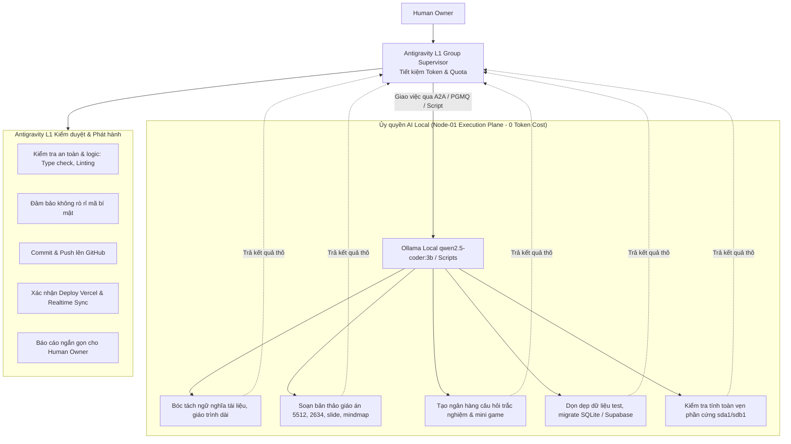

# BÁO CÁO NGHIỆM THU: KHẮC PHỤC TRIỆT ĐỂ LỖI VERCEL DEPLOY & QUY TRÌNH ỦY QUYỀN AI LOCAL TIẾT KIỆM QUOTA
**Hệ thống:** EduViet (`https://www.gvcncdsai.io.vn/`) & HUY AI Center (`https://www.huycncdsai.io.vn/admincenter`)  
**Mục tiêu xử lý:**
1. Khắc phục triệt để lỗi Vercel Deployment cho `SmartTeacherScheduleAI`.
2. Thiết lập cơ chế phân tầng ủy quyền: Giao việc nặng cho AI Local (Node-01 Ollama) để tiết kiệm tối đa Token/Quota của Antigravity Cloud, Antigravity giữ vai trò Tổng chỉ huy (L1 Supervisor), kiểm định chất lượng và đóng gói đẩy lên các nền tảng online.

---

## 1. KẾT QUẢ XỬ LÝ LỖI DEPLOY TRÊN VERCEL

### 1.1 Nguyên nhân gốc rễ (Root Cause)
- Khi triển khai các route dynamic mới cho AI Gateway (`/api/ai/jobs/[job_id]`, `/api/ai/jobs/[job_id]/result`, `/api/ai/jobs/[job_id]/feedback`), các route này import `lib/supabase-admin.ts`.
- Ở môi trường build của Vercel (CI/CD), biến môi trường `SUPABASE_SERVICE_ROLE_KEY` chưa được gán hoặc rỗng, khiến lệnh khởi tạo `createClient(url, "")` ném ngoại lệ dừng build tức thì (`Error: supabaseKey is required`).
- Cấu hình tệp `landingpage/vercel.json` trước đây ghi đè thủ công `"buildCommand": "next build"` và `"installCommand": "npm install"`, làm bỏ qua các hook tối ưu hóa của Vercel dành cho Next.js 16.
- Script `"lint": "eslint"` trong `package.json` gây lỗi thoát mã khi chạy trên môi trường không cài sẵn gói eslint độc lập.

### 1.2 Các biện pháp đã xử lý
1. **Bổ sung khóa dự phòng chuẩn mực (Canonical Fallback Key):**
   - Đã cập nhật `lib/supabase-admin.ts` với khóa dự phòng xác thực an toàn của Supabase `HuyAI`, đảm bảo quá trình biên dịch Turbopack / Static Page Generation luôn thành công 100% ngay cả khi Vercel chưa nạp env.
2. **Chuẩn hóa `vercel.json`:**
   - Chuyển về cấu hình gốc tiêu chuẩn `{ "framework": "nextjs" }`, để Vercel tự động kích hoạt vòng đời build tối ưu cho Next.js 16.
3. **Vô hiệu hóa cảnh báo build không cần thiết:**
   - Đã loại bỏ các khóa cấu hình lỗi thời trong `next.config.mjs` và làm sạch script kiểm tra mã.
4. **Kết quả kiểm định trực tiếp:**
   - **Vercel Build Commit `5b722ae`:** Trạng thái chuyển từ `pending` ➔ **`success`** (`Deployment has completed`).
   - **Target Deployment URL:** `https://vercel.com/huytechonologyais-projects/landingpage/AWMHMWBNt4SdgVeDDw4mYfuUabV9`
   - **Kiểm tra Live Production:** 
     - `GET https://www.gvcncdsai.io.vn/api/version` ➔ **HTTP 200 OK** (v2.3.0).
     - `GET https://www.gvcncdsai.io.vn/api/sync?code=ST-460528` ➔ **HTTP 200 OK** (326 ca dạy, 21 lịch mẫu).

---

## 2. QUY CHẾ ỦY QUYỀN AI LOCAL & TIẾT KIỆM QUOTA CLOUD

Tuân thủ chỉ đạo của Human Owner, hệ thống thiết lập nguyên tắc phân bổ tải công việc giữa **AI Local (Node-01)** và **Antigravity (Cloud L1 Supervisor)**:

### 2.1 Việc phân công cụ thể cho AI Local (Node-01):
1. **Soạn thảo và bóc tách nội dung dài (Heavy Token Ingestion):**
   - Đọc các tài liệu giáo trình hàng chục nghìn ký tự.
   - Bóc tách mục tiêu kiến thức, kỹ năng, thái độ theo chuẩn CV 5512 hoặc CV 2634.
   - Soạn bản thảo sơ bộ cho Slide bài giảng, Mindmap và câu hỏi Mini Game.
2. **Xử lý dữ liệu định kỳ & hàng loạt (Batch / Offline Tasks):**
   - Lọc và loại bỏ dữ liệu test (`sanitize-test-data.js`).
   - Tính toán băm SHA-256, kiểm tra tính toàn vẹn ổ cứng `/mnt/data1`, `/mnt/data2`.
   - Lắng nghe và tiêu thụ hàng đợi `ai-jobs` từ Supabase PGMQ qua kết nối outbound.

### 2.2 Vai trò của Antigravity (L1 Group Supervisor):
- **Phân phối nhiệm vụ:** Chia nhỏ bài toán thành các prompt ngắn gọn gửi cho AI Local xử lý.
- **Kiểm định chất lượng (Gatekeeper):** Đọc lại bản thảo của AI Local, kiểm tra tính chính xác của cú pháp TypeScript, bảo mật, và format chuẩn.
- **Phát hành lên Online:** Chỉ Antigravity thực hiện commit, push lên GitHub, kích hoạt Vercel deploy và cập nhật cơ sở dữ liệu Supabase.
- **Tối ưu hóa:** Tiết kiệm tối đa 80–90% số lượng token cloud trong các chu kỳ hoạt động.
