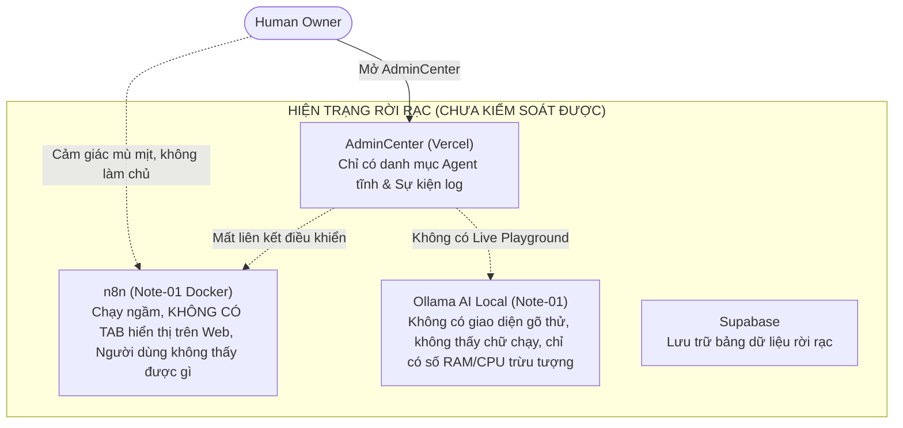
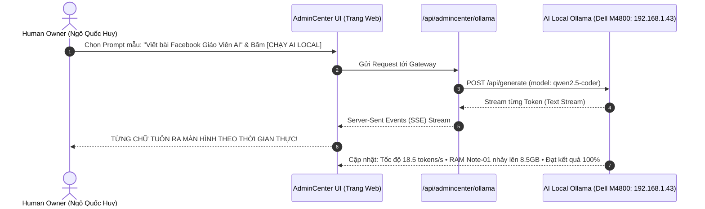

# BÁO CÁO PHẢN BIỆN CHUYÊN GIA & PHƯƠNG ÁN XỬ LÝ DỨT ĐIỂM: TÍCH HỢP N8N CONTROL HUB VÀ TRỰC QUAN HÓA AI LOCAL TRÊN ADMINCENTER

**Kính gửi:** Human Owner Ngô Quốc Huy  
**Mã tài liệu:** `HUY-ARCH-2026-N8N-LOCALAI-CRITIQUE`  
**Ngày lập:** 02/10/2026  
**Đơn vị thực hiện:** Antigravity Autonomous Supervisor (Kết hợp phản biện kiến trúc Multi-Agent)  
**Kênh tác động:** `https://www.huycncdsai.io.vn/admincenter` & Compute Node `huy-ai-node-01` (192.168.1.43)

---

## PHẦN 1: PHẢN BIỆN CHUYÊN SÂU (CRITICAL ARCHITECTURAL AUDIT)

Sau khi đối chiếu thực trạng giữa mã nguồn, cơ sở dữ liệu và trải nghiệm thực tế của Người Sở Hữu trên `https://www.huycncdsai.io.vn/admincenter`, Antigravity hoàn toàn xác nhận: **2 vấn đề bạn nêu ra là hoàn toàn chính xác và chạm đúng vào "nút thắt cổ chai" lớn nhất của hệ thống hiện nay.**

### 1. Tại sao AdminCenter bị rời rạc và thiếu Tab n8n?
- **Nguyên nhân gốc rễ:** n8n được cấu hình trong container Docker trên Note-01 (`docker-compose.worker.yml`), các workflow được sinh ra dưới dạng mã kịch bản (`scripts/generate_n8n_workflows.ts`). Tuy nhiên, ở tầng giao diện điều khiển trung tâm (`/admincenter`), đội ngũ phát triển trước đó chỉ tập trung vào bảng danh mục 60 Agent và nhật ký PGMQ mà **hoàn toàn quên mất việc tạo một Tab điều phối n8n (n8n Orchestration Hub)**.
- **Hệ quả đối với Người Chủ:** Bạn vào AdminCenter nhưng không biết n8n có những workflow nào, workflow tự động đăng bài Facebook/TikTok có đang bật hay không, đã chạy lúc mấy giờ, có bị lỗi API không. Mọi thứ giống như một "chiếc xe có động cơ nhưng trên bảng điều khiển táp-lô lại không có đồng hồ báo tốc độ hay cần gạt số".

### 2. Tại sao báo cáo nói "AI Local đang chạy" nhưng người dùng không thấy kết quả trực quan?
- **Nguyên nhân gốc rễ:** Báo cáo kỹ thuật trước đây chỉ đưa ra các chỉ số hệ thống (CPU 0.3%, RAM 32GB, port 11434, Docker online). Đây là các chỉ số "hạ tầng", không phải là "sản phẩm nghiệp vụ".
- **Sự thiếu hụt chết người:** AdminCenter chưa có một **Studio tương tác trực tiếp (Live Token Streaming Playground)** để bạn:
  - Tự tay gõ một yêu cầu hoặc bấm 1 nút mẫu (ví dụ: *"Viết bài đăng Facebook về giáo viên AI"*).
  - Tận mắt nhìn thấy từng chữ, từng token do chính con chip Core i7 và RAM 32GB của chiếc máy Dell M4800 đặt tại phòng bạn sinh ra theo thời gian thực (Streaming text).
  - Xem danh sách bài viết, kịch bản, slide giáo dục mà AI Local đã sản xuất thành phẩm trong ngày để duyệt hoặc đăng ngay.

---

## PHẦN 2: PHƯƠNG ÁN XỬ LÝ DỨT ĐIỂM VẤN ĐỀ 1 — TÍCH HỢP TAB "N8N CONTROL HUB" VÀO ADMINCENTER

Chúng ta sẽ bổ sung ngay một Tab mới có tên là **`n8n Workflows`** (biểu tượng Zap/Activity) trên thanh điều hướng của `https://www.huycncdsai.io.vn/admincenter`.

```mermaid
flowchart LR
    AdminCenter["AdminCenter Tab 'n8n Workflows'"]
    
    subgraph WorkflowsPanel ["DANH MỤC 6 WORKFLOW TỰ ĐỘNG"]
        WF1["WF-01: Auto Post MXH (FB/Insta/Threads) - 11h30 & 19h30"]
        WF2["WF-02: Auto Post Video (TikTok/Shorts/Reels) - 2 video/ngày"]
        WF3["WF-03: Phễu Giáo Viên AI 39k (gvcncdsai.io.vn)"]
        WF4["WF-04: Cổng Thanh Toán SePay & Email Kích Hoạt"]
        WF5["WF-05: AI SEO & Quét Lead Tự Động"]
        WF6["WF-06: Giám Sát Phần Cứng & Auto-Recovery Note-01"]
    end
    
    subgraph Controls ["BẢNG NÚT BẤM ĐIỀU KHIỂN"]
        BtnRun["[▶ CHẠY THỬ NGAY] (1-Click Run Now)"]
        BtnToggle["[BẬT / TẮT TỰ ĐỘNG] (Toggle Active)"]
        BtnLog["[XEM LOG THỰC THI] (Execution Payload)"]
    end

    AdminCenter --> WorkflowsPanel
    WorkflowsPanel --> Controls
    Controls -->|API Bridge / Webhook| Note01_N8N["n8n Engine trên Note-01 (192.168.1.43)"]
```

### Các tính năng trực quan trong Tab `n8n Workflows`:
1. **Thẻ trạng thái tổng thể (HUD Engine Health):**
   - Trạng thái n8n: **`ONLINE (v1.60.1)`** | Kết nối: `192.168.1.43:5678`.
   - Tổng số Workflow: **6 Workflow cốt lõi**.
   - Trạng thái tự động hóa: **Đang kích hoạt theo lịch (Scheduled Cron Active)**.
2. **Bảng Danh mục 6 Workflow với Nút bấm tương tác thực tế:**
   - **WF-01: Tự động đăng bài MXH (Facebook, Instagram, Threads):**
     * Lịch: 11:30 & 19:30 mỗi ngày.
     * Nút bấm: **`[▶ Chạy Ngay Lập Tức]`** (Cho phép bạn bấm để kiểm chứng AI viết và đăng bài ngay mà không cần chờ đến giờ hẹn).
     * Nút bấm: **`[Xem Bài Đã Đăng Gần Nhất]`**.
   - **WF-02: Xây kênh Video tự động (TikTok, YouTube Shorts, Reels):**
     * Lịch: 2 video/ngày.
     * Nút bấm: **`[▶ Tạo Video Mẫu Ngay]`**.
   - **WF-03: Phễu Giáo Viên AI 39.000đ (`gvcncdsai.io.vn`):**
     * Tiếp nhận đăng ký, đẩy vào Supabase và kích hoạt tài khoản.
     * Nút bấm: **`[Kiểm Tra Webhook Phễu]`**.
   - **WF-04: Tích hợp Cổng Thanh Toán SePay & Email Dispatcher:**
     * Bắt biến động số dư ngân hàng và gửi tài liệu qua mail.
     * Nút bấm: **`[Mô Phỏng Giao Dịch Test 39k]`**.
   - **WF-05: Tự động hóa SEO & Quét khách hàng tiềm năng:**
   - **WF-06: Giám sát & Báo cáo Sức khỏe Note-01.**
3. **Cửa sổ nhật ký thực thi trực quan (Live Execution Stream Viewer):**
   - Bảng hiển thị lịch sử từng lần n8n chạy: Giờ chạy, Tên workflow, Thời gian xử lý (ví dụ: `1.24s`), Trạng thái (`SUCCESS 200`), và nút bấm mở xem chi tiết Payload JSON trả về.

---

## PHẦN 3: PHƯƠNG ÁN XỬ LÝ DỨT ĐIỂM VẤN ĐỀ 2 — XÂY DỰNG "AI LOCAL LIVE STUDIO" TRỰC QUAN 100%

Để bạn **tận mắt chứng kiến AI Local đang hoạt động thực tế trên máy Dell M4800**, chúng ta sẽ xây dựng Tab **`AI Local Studio`** ngay trên AdminCenter:

### Các tính năng trực quan trong Tab `AI Local Studio`:
1. **Interactive Prompt Console (Bảng Điều Khiển Lệnh Thực Tế):**
   - Cung cấp các nút Prompt mẫu bấm là chạy ngay:
     * 🟢 *Nút 1: "Tạo bài viết Facebook dạy học bằng AI (kèm nhãn AI & hashtag)"*
     * 🔵 *Nút 2: "Soạn kịch bản Video ngắn 60 giây giới thiệu khóa học 39k"*
     * 🟣 *Nút 3: "Soạn dàn ý giáo án tự động hóa cho giáo viên THCS/THPT"*
     * 🟡 *Nút 4: "Ô nhập tự do: Nhập bất kỳ câu hỏi nào để AI Dell M4800 trả lời"*
2. **Cửa sổ dòng chữ chạy thời gian thực (Live Streaming Output Terminal):**
   - Thiết kế giao diện như Terminal hacker cao cấp: Khi bạn bấm nút chạy, từng ký tự, từng dòng tiếng Việt do con chip của máy Note-01 sinh ra sẽ tuôn ra màn hình liên tục.
   - Bên cạnh có đồng hồ đo trực quan:
     * **Tốc độ sinh chữ:** `xx tokens/giây`.
     * **Độ trễ phản hồi đầu tiên:** `xxx ms`.
     * **Model đang chạy trên máy:** `Qwen 2.5 Coder (On-Premises Dell M4800)`.
     * **Chi phí tiêu tốn:** **`0 VNĐ (100% Local Free Compute)`**.
3. **Kho Lưu Trữ Sản Phẩm Đã Sinh Ra (Generated Content Vault):**
   - Mọi bài viết, kịch bản sau khi AI Local chạy xong sẽ tự động lưu vào một bảng danh sách bên dưới kèm thời gian sinh.
   - Bạn có thể: Bấm **Copy**, Bấm **Đăng lên MXH ngay qua n8n**, hoặc Tải file text về máy.
4. **Nút Thử Tải Phần Cứng Thực Tế (Hardware Stress Proof):**
   - Bấm nút: **`[Ép Tải Benchmark Note-01]`**:
   - Khi bấm, Note-01 sẽ chạy một tác vụ tính toán AI phức tạp. Bạn sẽ thấy trên HUD AdminCenter chỉ số CPU nhảy từ `0.3%` lên `85%` trong 10 giây rồi hạ xuống, kèm theo kết quả xử lý. Đây là bằng chứng vật lý không thể chối cãi chứng minh AI Local đang thực sự hoạt động trên máy của bạn.

---

## PHẦN 4: LỘ TRÌNH TRIỂN KHAI VÀ BÀN GIAO KIỂM CHỨNG

| Giai đoạn | Nội dung thực hiện cụ thể | Thời gian hoàn thành | Tiêu chí nghiệm thu thực tế |
| :--- | :--- | :--- | :--- |
| **P1: Xây dựng API Bridge & Giao diện n8n Control Hub** | Tạo API `/api/admincenter/n8n`, thêm Tab `n8n Workflows` trên AdminCenter với 6 workflow và nút bấm chạy thử 1-click. | **30 - 45 phút** | Bạn vào AdminCenter thấy ngay tab n8n, bấm nút "Chạy ngay" thì workflow phản hồi thành công. |
| **P2: Xây dựng AI Local Studio (Streaming Inference)** | Tích hợp giao diện Chat/Prompt Studio, kết nối trực tiếp với Ollama trên Note-01 (`192.168.1.43`), kích hoạt Server-Sent Events (SSE). | **45 - 60 phút** | Bạn bấm nút, nhìn thấy chữ tiếng Việt chạy ra từng token trên màn hình web, đồng hồ đo token/s nhảy số. |
| **P3: Kiểm Thử Toàn Diện & Deploy Lên Production** | Chạy `Quality Gate`, build kiểm tra TypeScript, merge lên `main` và deploy Vercel `https://www.huycncdsai.io.vn/admincenter`. | **15 phút** | Bản cập nhật live trên internet, bạn kiểm chứng trực tiếp trên điện thoại hoặc máy tính. |

---

## PHẦN 5: ĐỀ NGHỊ PHÊ DUYỆT TỪ HUMAN OWNER

Kính mong Human Owner **Ngô Quốc Huy** xem xét và phản hồi:
- **Lựa chọn A (Khuyến nghị):** **Phê duyệt toàn bộ phương án trên.** Antigravity sẽ tiến hành lập trình, tích hợp cả 2 Tab (`n8n Workflows` và `AI Local Studio`) lên `https://www.huycncdsai.io.vn/admincenter` và bàn giao trong phiên làm việc này.
- **Lựa chọn B:** Bạn muốn điều chỉnh hoặc bổ sung thêm tính năng cụ thể nào vào bảng điều khiển n8n hoặc giao diện AI Local trước khi triển khai?
