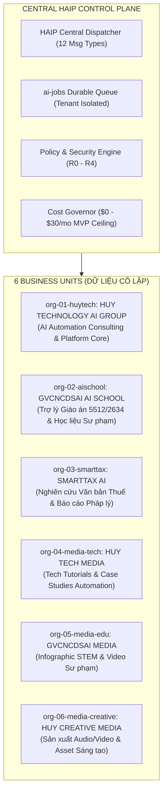
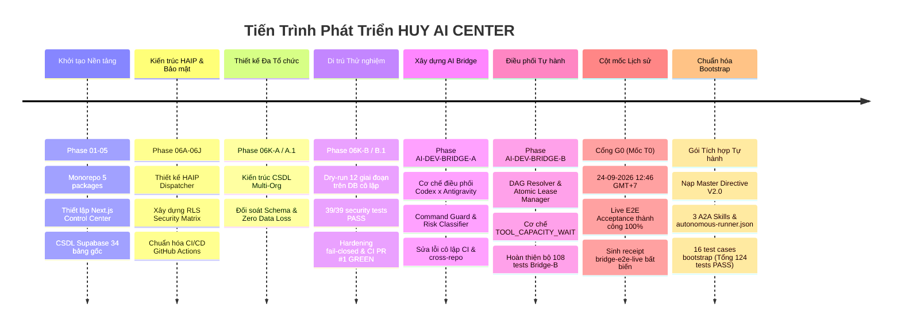
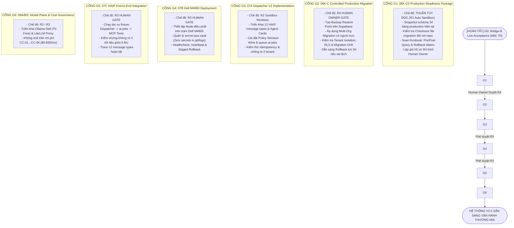

# BÁO CÁO TỔNG KẾT TOÀN DIỆN HỆ THỐNG & TÀI NGUYÊN SỞ HỮU
# HUY AI AGENCY GROUP V2.0 / HUY AI CENTER

- **Thời điểm xuất báo cáo:** 2026-09-24 13:55:00 (GMT+7)
- **Tác nhân lập báo cáo:** Antigravity AI (`CANONICAL_PLANNER_AND_FINAL_AUDITOR`)
- **Chế độ kiểm toán:** `READ_ONLY`
- **Phiên bản kiến trúc:** 2.0 (HAIP Control Plane & Multi-Agent OS)
- **Tình trạng sản xuất:** `PRODUCTION_SCOPE = ZERO_TOUCH` | `PRODUCTION_MUTATION = DENY`

---

## 1. TỔNG QUAN HỆ ĐIỀU HÀNH DOANH NGHIỆP ĐA TÁC TỬ (EXECUTIVE OVERVIEW)

**HUY AI AGENCY GROUP V2.0** là một hệ điều hành doanh nghiệp đa tác tử (Multi-Agent Operating System) tích hợp chính sách kiểm soát tập trung (HAIP Control Plane), phục vụ **sáu đơn vị vận hành (Business Units - BUs)** trên cùng một nền tảng dữ liệu phân vùng nghiêm ngặt theo nguyên tắc **Strictest-Wins**:

### Các Trụ Cột Kiến Trúc Đã Chốt:
1. **25 Logical Agents:** Phân bổ theo 5 tầng phân cấp: `Human Owner → L4 Group Coordinator → L3 Company Leads (6 BUs) → L2 Department Agents → L1 Specialist Agents → L0 Tool Executors`.
2. **HAIP Protocol:** Chuẩn hóa đúng 12 message types; hàng đợi bền vững `ai-jobs`; kết nối tool qua giao thức Model Context Protocol (MCP).
3. **Phân Định Trách Nhiệm AI Ba Trụ Cột:**
   - **Google Antigravity:** `CANONICAL_PLANNER_AND_FINAL_AUDITOR` (Chỉ đọc, không chỉnh sửa repo, không đụng production, audit ra quyết định `PASS` / `FAIL` / `BLOCKED`).
   - **OpenAI Codex CLI:** `IMPLEMENTATION_WORKER` duy nhất (Chỉ sửa mã nguồn trong `.agent-worktrees/`, sandbox `workspace-write`, tối đa 200 dòng/iteration, tối đa 3 chu kỳ sửa lỗi).
   - **Claude Free (Anthropic):** `READ_ONLY_ARCHITECTURAL_ANALYST` (Tư vấn, phản biện kiến trúc, độc lập, không chặn luồng critical path).
4. **Kỷ Luật An Toàn Tuyệt Đối:**
   - R0–R2: Tự động hóa trong worktree cô lập.
   - R3: Dừng tại `HUMAN_GATE_R3`.
   - R4: Dừng tại `HUMAN_GATE_R4` (Chỉ Human Owner phê duyệt).
   - Cấm tự ý merge `main`, cấm force push, cấm `danger-full-access`, cấm chạm database production.
5. **Ngân Sách MVP Siêu Tối Ưu:** Mục tiêu **0–30 USD/tháng**, đo lường chi phí thực tế theo các mã `CC-01` đến `CC-06` trước khi nâng hạn mức.

---

## 2. LỊCH SỬ TIẾN TRÌNH PHÁT TRIỂN (TỪ KHỞI TẠO ĐẾN HIỆN TẠI)

### Chi Tiết Từng Giai Đoạn Trọng Yếu:
* **Phase 06K-B & 06K-B.1 (Multi-Org Migration Dry-Run):** Đã hoàn tất thử nghiệm 12 bước (snapshot, pre-query, DDL migration, security assertion, seed dữ liệu mẫu 6 BU, test RLS, rollback sạch và re-apply). Đạt 39/39 security tests, PR #1 đã merge sạch vào nhánh tính năng.
* **Phase AI-DEV-BRIDGE-A / A.1 / A.2 (Bridge Foundation):** Xây dựng bộ điều phối đơn nhiệm, `command-guard.ts` chặn toàn bộ lệnh nguy hiểm (`rm -rf`, `DROP TABLE`, `push origin main`), bộ lọc `log-redactor.ts` tự động xóa token/key.
* **Phase AI-DEV-BRIDGE-B (Autonomous Backlog Orchestrator):**
  - Chuyển đổi từ chạy lệnh lẻ sang chạy backlog tự hành dựa trên DAG của `system-roadmap.json`.
  - Khóa tệp độc quyền nguyên tử (`fs.openSync(..., 'wx')`) tại `.artifacts/agent-bridge/leases/`.
  - Giới hạn tuần tự nghiêm ngặt: `maxConcurrency = 1`.
  - Cơ chế `TOOL_CAPACITY_WAIT`: Thoát êm không trừ chu kỳ sửa lỗi khi gặp rate-limit hoặc hết quota token.
* **VƯỢT CỔNG G0 — XÁC LẬP MỐC T0 (24-09-2026 12:46 GMT+7):**
  - Thực hiện kiểm thử chấp thuận thực tế giữa Codex CLI và Antigravity CLI trong môi trường Ubuntu 24.04 WSL2.
  - Codex tự sinh mã trong `.agent-worktrees/`, chạy typecheck, Antigravity audit diff đạt `PASS`.
  - Biên nhận lưu tại `.artifacts/agent-bridge/acceptance/bridge-e2e-live-761a3530-157c-4a8b-802c-182e9ebbdfa4.json`.
  - Đánh dấu hệ sinh thái chính thức bước vào kỷ nguyên vận hành đo lường được (**Mốc T0**).
* **Hoàn tất Gói Bootstrap Tự hành (Autonomous Bootstrap Integration):**
  - Tích hợp `MASTER_AUTONOMOUS_TASK_ACTIVATION.md` và `MULTI_AI_ORCHESTRATION_CONTRACT.md`.
  - Khởi tạo 3 kỹ năng A2A: `11_A2A_EXECUTION_CODEX.md`, `12_A2A_EXECUTION_ANTIGRAVITY.md`, `13_A2A_EXECUTION_CLAUDE_FREE.md`.
  - Viết `automation/agent-bridge/src/bootstrap-loader.ts` (150 dòng chuẩn) kiểm tra mã băm SHA-256 của toàn bộ tệp quy tắc trước khi chạy.
  - Bổ sung 16 test cases mới ➔ Nâng tổng số bài kiểm thử bridge lên **124/124 tests PASS 100%**.

---

## 3. TOÀN BỘ NGUỒN TÀI NGUYÊN HỆ THỐNG ĐANG SỞ HỮU

Dưới đây là bảng kiểm kê đầy đủ toàn bộ tài sản kỹ thuật, phần cứng, phần mềm, mô hình AI và tài liệu:

### 3.1. Tài Nguyên Mã Nguồn & GitHub (Source Code Assets)
* **Kho lưu trữ chính (Repository):** `https://github.com/HuyTechonologyAI/huy-ai-center`
* **Cấu trúc Monorepo:** Gồm 5 workspace packages:
  1. `packages/config` (`@huy-ai/config`): Cấu hình môi trường, hằng số hệ thống.
  2. `packages/contracts` (`@huy-ai/contracts`): Schema TypeScript, định nghĩa 12 HAIP message contracts, TaskContract.
  3. `packages/shared` (`@huy-ai/shared`): Thư viện dùng chung, logger, tiện ích mã hóa.
  4. `apps/control-center` (`@huy-ai/control-center`): Giao diện quản trị Next.js 14, Tailwind CSS, Radix UI.
  5. `apps/dispatcher` (`@huy-ai/dispatcher`): Engine điều phối tác vụ HAIP, worker lắng nghe `ai-jobs`.
* **Trạng thái Git hiện tại:**
  - Nhánh làm việc: `feature/ai-dev-bridge-b-autonomous-backlog`.
  - Commit HEAD: **`c8a0f64`** (Đi trước `main` 24 commits, 0 commit behind).
  - Nhánh gốc: `main` (commit `1a0d43e`) được khóa bởi GitHub Ruleset `Protect main — Production`.
  - Pull Request: [PR #2 (Draft)](https://github.com/HuyTechonologyAI/huy-ai-center/pull/2) đang mở.
  - GitHub Actions CI: Quality Gate Run `35951334193` đã **PASS 100%**.

### 3.2. Hạ Tầng Tính Toán & Runtime (Compute Infrastructure)
1. **Máy trạm Windows 11 Host:**
   - Hệ điều hành: Windows 11 Pro 64-bit.
   - Ứng dụng điều hành: PowerShell 7, Antigravity IDE, Claude Desktop Client.
   - Thư mục lưu trữ: `C:\Users\Admin\.gemini\antigravity\scratch\huy-ai-center` và `C:\Users\Admin\Claude`.
2. **Máy ảo Ubuntu 24.04 WSL2 (Trọng tâm thực thi Linux ext4):**
   - Vị trí: `/home/huyai007/workspace/huy-ai-center`.
   - Node.js: `v24.21.0` (Quản lý qua NVM).
   - npm: `11.19.0`.
   - Git: `2.43.0`.
   - GitHub CLI (`gh`): `2.45.0`.
3. **Trạm máy chủ Dell Precision M4800:**
   - Phần cứng sẵn sàng; đang ở trạng thái chuẩn bị cho Cổng G4 (chờ phê duyệt R3 sau Cổng G3).

### 3.3. Tài Nguyên Các Tác Nhân AI & Model Plane (AI Workers)
* **OpenAI Codex CLI:**
  - Phiên bản: `codex-cli 0.156.1`.
  - Xác thực: Lưu tại `~/.codex/auth.json` (chế độ ChatGPT session).
  - Kết nối: WebSocket trực tiếp `wss://chatgpt.com/backend-api/` (HTTP 101 Switching Protocols OK).
  - Chẩn đoán `codex doctor`: 20/20 tiêu chí OK.
  - Phân quyền: Chỉ ghi trong `.agent-worktrees/<task-id>`, sandbox `workspace-write`.
* **Google Antigravity CLI:**
  - Phiên bản: `1.2.9`.
  - Phân quyền: `ROLE = PLANNER_AND_AUDITOR`, `WRITE_PERMISSION = NONE`.
  - Giao thức gọi: Chạy qua stdin với định dạng text để đảm bảo an toàn shell trên Windows & Linux.
* **Claude Free (Anthropic):**
  - Phiên bản: Claude Desktop Application (`AnthropicClaude` đang chạy ngầm trên Windows).
  - Điểm kết nối dữ liệu: Thư mục Context Capsule tại `C:\Users\Admin\Claude\capsules\CLAUDE_CONTEXT_CAPSULE_LATEST.md`.
  - Phân quyền: Cố vấn kiến trúc chỉ đọc, không chặn pipeline tự động.
* **Mô hình Cục bộ (Local Models chuẩn bị cho G6):**
  - Ollama: Mô hình cục bộ Tier T0 (chi phí 0 USD/tháng).
  - LiteLLM Proxy Router: Quản lý định tuyến T0 đến T4 theo chính sách chi phí.

### 3.4. Cơ Sở Dữ Liệu & Điện Toán Đám Mây (Databases & Cloud)
* **Supabase Production Cloud (`bdeluacbzbdflxubhpha`):**
  - Chế độ bảo vệ: `PRODUCTION_SCOPE = ZERO_TOUCH`, `PRODUCTION_MUTATION = DENY`.
  - Hiện trạng: 34 bảng public gốc trước multi-org migration.
  - Kiểm soát: Không có bất kỳ kết nối hay lệnh DDL nào được phép chạm vào trước Cổng G2 (ủy quyền R4).
* **Supabase Local / Isolated Docker DB:**
  - Môi trường thử nghiệm cục bộ đã xác minh 100% các script migration, trigger, RPC, RLS và rollback.
* **Cloudflare & Vercel:**
  - Tên miền doanh nghiệp: `huycncdsai.io.vn`.

### 3.5. Tài Sản Pháp Quy & Tài Liệu Kỹ Thuật (Governance & Specifications)
* **Bộ Quy tắc Điều phối:**
  - `docs/automation/MASTER_AUTONOMOUS_TASK_ACTIVATION.md` (Protocol: `HUY-A2A-AUTONOMY/1.0`).
  - `docs/automation/MULTI_AI_ORCHESTRATION_CONTRACT.md` (Master Directive V2.0).
  - `config/autonomy/autonomous-runner.json` (Cấu hình nạp bootstrap tự hành).
  - `config/autonomy/system-roadmap.json` (Lộ trình DAG chuẩn hóa).
  - `PROJECT_STATE.md` (Báo cáo trạng thái kỹ thuật).
* **Bộ Kỹ năng A2A (A2A Skills):**
  - `skills/a2a/11_A2A_EXECUTION_CODEX.md`
  - `skills/a2a/12_A2A_EXECUTION_ANTIGRAVITY.md`
  - `skills/a2a/13_A2A_EXECUTION_CLAUDE_FREE.md`
* **Bộ Kiểm Thử Tất Định (Test Suites):**
  - Tổng số test cases hiện có: **124 bài kiểm thử** (10 test suites, 100% PASS):
    1. `tests/automation/bootstrap-loader.test.ts` (16 tests - Nạp bootstrap & fail-closed)
    2. `tests/automation/risk-classifier.test.ts` (Phân loại rủi ro R0-R4)
    3. `tests/automation/command-guard.test.ts` (Chặn lệnh nguy hiểm)
    4. `tests/automation/approval-gate.test.ts` (Cổng phê duyệt R3/R4)
    5. `tests/automation/log-redactor.test.ts` (Lọc và ẩn secrets)
    6. `tests/automation/task-contract.test.ts` (Kiểm định schema TaskContract)
    7. `tests/automation/dry-run.test.ts` (Kiểm thử chấp thuận Live E2E)
    8. `tests/automation/security-cases.test.ts` (Bảo vệ scope & sandbox)
    9. `tests/automation/backlog-runner.test.ts` (Điều phối tuần tự DAG)
    10. `tests/automation/checkpoints.test.ts` (Xác thực checkpoint liên kết bất biến)
* **Bằng Chứng & Checkpoints Đã Lưu (Evidence Receipts):**
  - Receipt E2E Acceptance: `.artifacts/agent-bridge/acceptance/bridge-e2e-live-761a3530-157c-4a8b-802c-182e9ebbdfa4.json`.
  - Checkpoint Chain: `.artifacts/agent-bridge/checkpoints/bridge-autonomous-bootstrap-integration/` (Đầy đủ 6 giai đoạn: `RECEIVED` → `PLAN` → `DECOMPOSITION` → `IMPLEMENTATION` → `CROSS_REVIEW` → `DELIVERY`).

---

## 4. MA TRẬN PHÂN RANH DỮ LIỆU CỦA 6 ĐƠN VỊ VẬN HÀNH (MULTI-ORG BOUNDARY)

| Đơn vị (Tenant ID) | Phạm vi Sản phẩm & Dịch vụ | Ranh giới Dữ liệu & Quy tắc Bảo mật Tuyệt đối | Cổng Phê duyệt Đầu ra |
| :--- | :--- | :--- | :---: |
| **HUY TECHNOLOGY AI GROUP** (`org-01-huytech`) | Tư vấn AI Automation, điều phối HAIP, giám sát hệ thống. | Chỉ xem metadata & telemetry tổng hợp. Cấm truy cập raw PII học sinh hoặc chứng từ thuế. | R2 (Tự động trong sandbox) |
| **GVCNCDSAI AI SCHOOL** (`org-02-aischool`) | Trợ lý soạn giáo án 5512/2634, đề kiểm tra, slide bài giảng. | Dữ liệu học sinh/điểm số bị cô lập tuyệt đối; không bao giờ đưa vào dữ liệu media. | Bắt buộc Giáo viên ký duyệt |
| **SMARTTAX AI** (`org-03-smarttax`) | Nghiên cứu văn bản pháp luật thuế, soạn dự thảo tư vấn. | Dữ liệu hồ sơ thuế thuộc phân loại `RESTRICTED`. Tuyệt đối không phát hành tư vấn tự động. | Bắt buộc Chuyên gia Thuế ký duyệt |
| **HUY TECH MEDIA** (`org-04-media-tech`) | Xuất bản case study tự động hóa, hướng dẫn công nghệ. | Chỉ được sử dụng các artifact đã mang nhãn `PUBLIC_APPROVED`. | Human Review trước khi phát hành |
| **GVCNCDSAI MEDIA** (`org-05-media-edu`) | Infographic STEM, video phương pháp dạy học, tin giáo dục. | Chỉ sử dụng nội dung sư phạm được duyệt; không chứa thông tin định danh cá nhân (PII). | Ban Biên tập Sư phạm duyệt |
| **HUY CREATIVE MEDIA** (`org-06-media-creative`) | Sản xuất audio, video ngắn, asset đồ họa tự động. | Sử dụng kho asset bản quyền; mọi ấn phẩm phải qua kiểm duyệt bản quyền và nội dung. | Human Gate trước khi xuất bản |

---

## 5. LỘ TRÌNH CÁC CỔNG KỸ THUẬT TIẾP THEO (G1 ĐẾN G6)

Sau khi Cổng **G0 (Mốc T0)** đã hoàn tất thành công, chuỗi triển khai kỹ thuật bắt buộc theo thứ bậc DAG như sau:

---

## 6. DANH SÁCH CÁC QUYẾT ĐỊNH HUMAN OWNER CẦN DUYỆT ĐÚNG THỜI ĐIỂM

1. **Sau Cổng G1:** Xem xét gói hồ sơ `06K-C0 readiness package` (snapshot, checksums, rollback runbook) và quyết định có phê duyệt **Ủy quyền R4** để thực hiện Cổng G2 (Migration Production) hay tiếp tục giữ `ZERO_TOUCH`.
2. **Sau Cổng G3:** Xem xét kết quả kiểm thử Dispatcher V2 trên môi trường cô lập và phê duyệt **Cổng R3** để triển khai node trên máy trạm Dell M4800.
3. **Trước các Pilot thương mại:** Chỉ định nhân sự chuyên môn con người ký duyệt các ấn phẩm của SmartTax, giáo án AI School và các sản phẩm Media công cộng.
4. **Định kỳ hàng tháng:** Xem xét bảng đo lường chi phí thực tế theo các mã `CC-01` đến `CC-06` để quyết định nâng trần ngân sách hoặc mở rộng quy mô agent.
5. **Duyệt PR #2:** Thực hiện review và merge [PR #2](https://github.com/HuyTechonologyAI/huy-ai-center/pull/2) vào nhánh `main` khi chuỗi kiểm toán đạt yêu cầu. AI tuyệt đối không tự ý merge vào `main`.

---
*Báo cáo được trích xuất tự động và xác thực bởi Antigravity — Canonical Planner & Final Auditor.*
