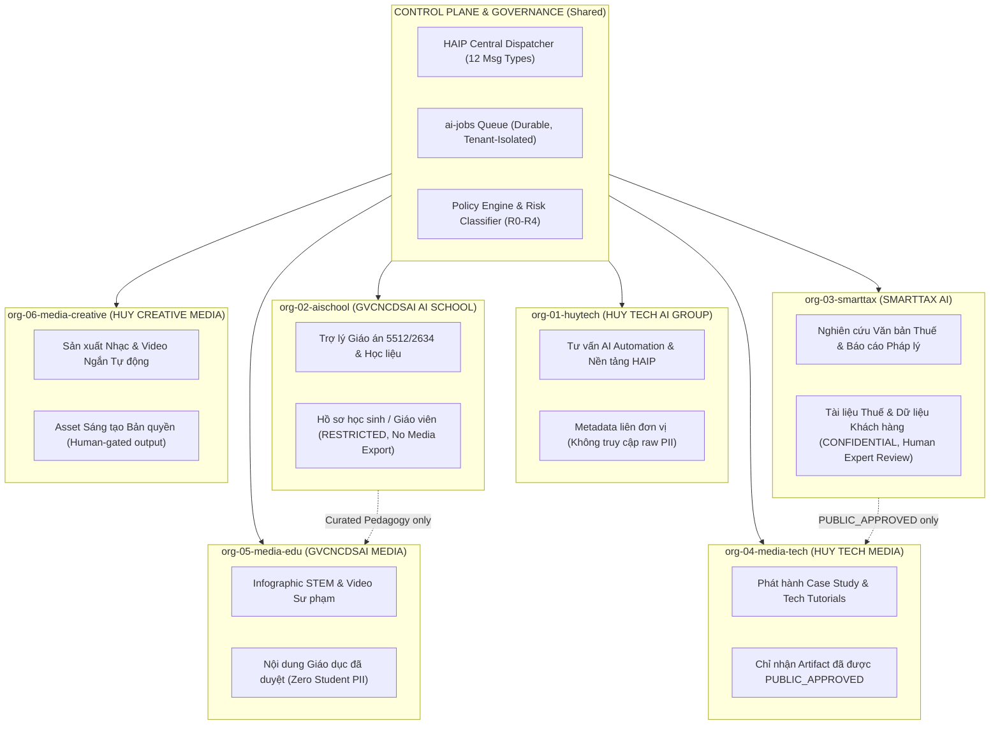
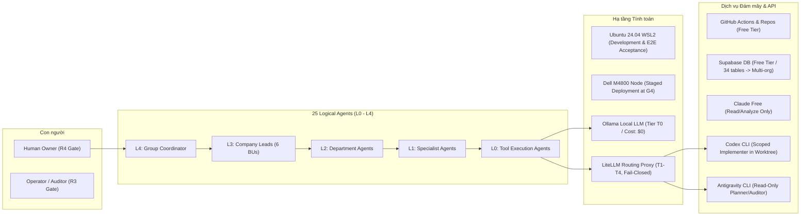
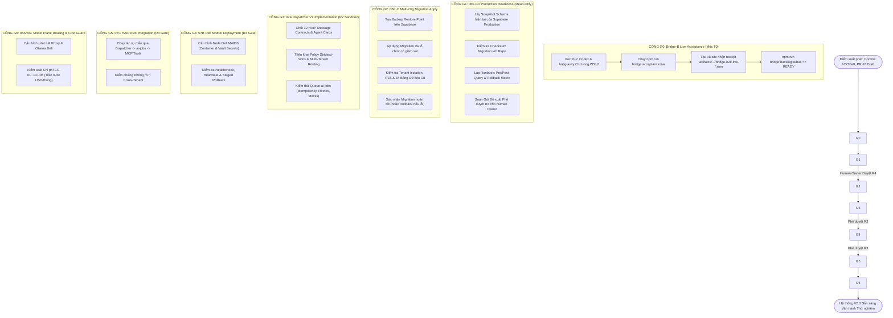

# RÀ SOÁT TOÀN DIỆN HỆ THỐNG & CHUẨN BỊ NGUỒN LỰC TRIỂN KHAI
## HUY AI AGENCY GROUP V2.0

- **Thời điểm rà soát:** 2026-09-24 11:55:00 (GMT+7)
- **Vai trò:** `CANONICAL_PLANNER_AND_FINAL_AUDITOR`
- **Chế độ kiểm toán:** `READ_ONLY` (ZERO WRITE TO PRODUCTION / CODEBASE)
- **Mục tiêu:** Rà soát hiện trạng thực chứng, kiểm toán tài nguyên phần cứng/phần mềm/mô hình, định hình ranh giới dữ liệu cho 6 BU, và xác định điều kiện kỹ thuật kích hoạt Cổng G0 hướng tới Mốc T0.

---

## 1. BẢNG ĐỐI CHIẾU THỰC CHỨNG HỆ THỐNG (GROUND TRUTH EVIDENCE)

Dựa trên việc kiểm tra trực tiếp môi trường Windows host, máy ảo Ubuntu 24.04 WSL2, Git repository và CI/CD:

| Thành phần | Trạng thái Thực tế đã Xác minh | Bằng chứng Kỹ thuật (Logs / Shas / Exit Codes) | Đánh giá Sẵn sàng |
| :--- | :--- | :--- | :---: |
| **Git Repository & Branch** | Nhánh `feature/ai-dev-bridge-b-autonomous-backlog` tại commit **`b2730a8`** (đã pull sạch, working tree clean). | `git rev-parse HEAD` = `b2730a8c4dd02feca0259e39cdf73ac976002ef2`. Đi trước `main` (commit `1a0d43e`) đúng 24 commits, 0 commit behind. | **PASS** |
| **GitHub PR & Ruleset** | PR #2 đang mở dạng **DRAFT** (`title: "AI-DEV-BRIDGE-B: guarded autonomous backlog runner"`), base `main`. Direct push vào `main` bị khóa bởi GitHub Ruleset `Protect main — Production`. | Query `gh pr view 2`: `{"baseRefName":"main","headRefName":"feature/ai-dev-bridge-b-autonomous-backlog","isDraft":true,"number":2,"state":"OPEN"}`. | **PASS** |
| **GitHub Actions CI** | CI Quality Gate chạy thành công 100% trên commit `b2730a8`. | Run ID `35951334193` (Job: Build shared, Typecheck, Test, Bridge Test 108/108 PASS). Lưu ý: CI ghi rõ `REAL_E2E: NOT_EXECUTED_CI_ENVIRONMENT`. | **PASS (CI)** |
| **Runtime WSL2 (Ubuntu 24.04)** | Máy ảo WSL2 `Ubuntu-24.04` hoạt động ổn định tại `/home/huyai007/workspace/huy-ai-center`. Môi trường Linux ext4 native. | `node -v` = `v24.21.0`, `npm -v` = `11.19.0`, `git` = `2.43.0`, `gh` = `2.45.0`, `codex-cli` = `0.156.1`, `antigravity` = `1.2.9`. | **PASS** |
| **Static Verification Monorepo** | Toàn bộ 5 gói monorepo (`config`, `contracts`, `shared`, `control-center`, `dispatcher`) vượt qua kiểm tra tĩnh. | `npm run typecheck` = Exit Code 0 (0 errors). | **PASS** |
| **Bridge Test Suite** | Bộ kiểm thử an toàn, command guard, risk classifier, approval gate, checkpoints. | `npm run test:bridge` = 108/108 PASS (0 failed, 0 skipped, thời gian chạy: ~38s). | **PASS** |
| **Backlog Engine State** | Bộ giải DAG `backlog-runner.ts` đã biên dịch và sẵn sàng điều phối. | `npm run bridge:backlog:status` trả về `{"status":"READY","taskId":"06k-c-readiness"}`. | **PASS** |
| **Live Acceptance (E2E Bridge-B)** | Kiểm tra receipt tại `.artifacts/agent-bridge/acceptance/`. Lần chạy trước đó (`bridge-e2e-live-36fad5ca...`) dừng ở chu kỳ 3 với `CORRECTION_REQUIRED`. Chưa có receipt `bridge-e2e-live-[uuid].json` đạt `PASS` cho HEAD `b2730a8`. | `assertLiveAcceptance` yêu cầu receipt hợp lệ gắn với commit không đổi của bridge. Đây là điều kiện tiên quyết để đạt mốc **T0** và mở Cổng **G0**. | **BLOCKED (G0 Pending)** |
| **Cơ sở dữ liệu Supabase** | 06K-B/06K-B.1 migration draft & rollback đã PASS trên môi trường cô lập. Production DB (`bdeluacbzbdflxubhpha`) vẫn giữ nguyên 34 bảng public gốc. | `PRODUCTION_SCOPE = ZERO_TOUCH`, `PRODUCTION_MUTATION = DENY`. Cổng G1 (06K-C0 readiness) thuần túy đọc; G2 (06K-C apply) cần ủy quyền R4 của Human Owner. | **GATED (R4 Required)** |

---

## 2. RÀ SOÁT PHÂN RANH DỮ LIỆU & KIẾN TRÚC 6 ĐƠN VỊ VẬN HÀNH (BU)

Hệ thống được thiết kế phục vụ 6 đơn vị dữ liệu/vận hành theo nguyên tắc **Strictest-Wins** và **Cô lập Tenant Tuyệt đối**:



### Chi tiết Phân ranh Dữ liệu & Quy tắc Cô lập:
1. **HUY TECHNOLOGY AI GROUP (`org-01-huytech`)**:
   - *Phạm vi:* Quản trị control plane, workflow automation nội bộ, giám sát SLA.
   - *Quyền truy cập dữ liệu:* Chỉ đọc metadata/telemetry tổng hợp; cấm tuyệt đối đọc bản ghi thuế (SmartTax) hoặc hồ sơ học sinh (AI School).
2. **GVCNCDSAI AI SCHOOL (`org-02-aischool`)**:
   - *Phạm vi:* Trợ lý giáo án theo khung 5512/2634, đề kiểm tra, ngân hàng câu hỏi.
   - *Ranh giới an toàn:* Mọi tài liệu tạo ra phải có giáo viên chuyên môn duyệt trước khi đưa vào lớp học. Dữ liệu học sinh/điểm số bị cô lập hoàn toàn, không bao giờ xuất sang các BU Media.
3. **SMARTTAX AI (`org-03-smarttax`)**:
   - *Phạm vi:* Tra cứu văn bản thuế, trích dẫn pháp luật, soạn thảo dự thảo tư vấn.
   - *Ranh giới an toàn:* Không đưa ra quyết định pháp lý tự động; kết quả đầu ra bắt buộc có chuyên gia con người ký duyệt. Tài nguyên thô không bao giờ rò rỉ ra ngoài tenant.
4. **HUY TECH MEDIA (`org-04-media-tech`)**:
   - *Phạm vi:* Bài viết kỹ thuật, case study giải pháp tự động hóa.
   - *Nguồn dữ liệu:* Chỉ nhận các artifact mang nhãn `PUBLIC_APPROVED` từ SmartTax hoặc HuyTech.
5. **GVCNCDSAI MEDIA (`org-05-media-edu`)**:
   - *Phạm vi:* Infographic STEM, tài liệu tập huấn giáo viên, video giáo dục.
   - *Nguồn dữ liệu:* Nội dung chuyên môn giáo dục được phê duyệt; tuyệt đối không chứa PII của học sinh hoặc giáo viên.
6. **HUY CREATIVE MEDIA (`org-06-media-creative`)**:
   - *Phạm vi:* Video ngắn, audio/nhạc tự động, tư liệu sáng tạo.
   - *Nguồn dữ liệu:* Kho asset bản quyền; yêu cầu human gate trước khi phân phối công khai.

---

## 3. RÀ SOÁT TÀI NGUYÊN HẠ TẦNG, CÔNG CỤ VÀ CHI PHÍ (MVP 0–30 USD/THÁNG)



### Kiểm toán Tài nguyên Thực tế:
- **Tài khoản & Hạn mức API:**
  - `Codex CLI`: Đã cài đặt (`0.156.1`). Cần xác thực phiên chạy thực trong WSL2 để sinh receipt E2E.
  - `Antigravity CLI`: Đã cài đặt (`1.2.9`). Cần xác thực phiên chạy thực trong WSL2 với quyền headless hạn chế (chỉ các lệnh read-only trong repo; không dùng `--dangerously-skip-permissions`).
  - `Claude Free`: Vai trò hỗ trợ phân tích, tổng hợp context capsule (read-only), không tham gia vào chuỗi tự động ghi code.
- **Hạ tầng Tính toán:**
  - Trạm máy tính xách tay Dell M4800: Đã sẵn sàng phần cứng. Cổng G4 (sau G3 và R3) mới tiến hành cấu hình orchestration runtime.
  - Ollama & LiteLLM: Cổng G6 (sau G5) mới triển khai cấu hình Model Plane theo routing T0–T4 (T0 local miễn phí; T1-T4 chỉ dùng khi có ngân sách ROI chứng minh).
- **Hạn mức Ngân sách (Cost Ceiling):**
  - MVP: **0–30 USD/tháng**.
  - Áp dụng Cost Caps từ `CC-01` đến `CC-06` cho 6 đơn vị.
  - Mỗi tác vụ đều có trần chi phí và cơ chế ngắt tự động (circuit breaker) nếu phát sinh token bất thường.

---

## 4. CHUỖI CỔNG TRIỂN KHAI KỸ THUẬT (DAG G0 → G6)



---

## 5. KẾ HOẠCH HÀNH ĐỘNG NGAY ĐỂ MỞ CỔNG G0 (ĐẠT MỐC T0)

Để chuyển trạng thái từ **Kế hoạch Đề xuất** sang **Triển khai Đo lường Thực tế (T0)**, các bước thực hiện tuần tự như sau:

### Bước 1: Chuẩn bị Xác thực CLI trong WSL2 (Thực hiện một lần trên phiên tương tác)
- Đăng nhập phiên tương tác tại máy ảo Ubuntu 24.04:
  ```bash
  cd ~/workspace/huy-ai-center
  codex login # hoặc kiểm tra API key / auth status
  agy auth # kiểm tra trạng thái xác thực của Antigravity
  ```
- Cấu hình quyền thực thi headless của Antigravity hẹp chỉ trong phạm vi các lệnh đọc (read-only inspect); **tuyệt đối không** dùng `--dangerously-skip-permissions`.

### Bước 2: Kích hoạt Live Acceptance Test để Sinh Receipt Thực chứng
- Chạy lệnh kiểm thử chấp thuận trực tiếp:
  ```bash
  npm run bridge:acceptance:live
  ```
- Lệnh này sẽ:
  1. Tạo nhánh kiểm thử cô lập `agent-task/bridge-e2e-live-<uuid>`.
  2. Giao việc cho Codex thực hiện một thay đổi mẫu hợp lệ trên `tests/fixtures/agent-bridge-dry-run/README.md`.
  3. Giao Antigravity thực hiện kiểm toán đối chiếu giữa Plan, Diff và kết quả `npm run typecheck`.
  4. Sau khi `PASS`, lưu receipt bất biến tại `.artifacts/agent-bridge/acceptance/bridge-e2e-live-<uuid>.json` gắn chặt với commit `b2730a8`.
  5. Tự động dọn dẹp worktree và fixture tạm thời.

### Bước 3: Xác nhận T0 và Mở Cổng G1
- Chạy kiểm tra trạng thái backlog:
  ```bash
  npm run bridge:backlog:status
  ```
- Khi `assertLiveAcceptance()` tìm thấy receipt hợp lệ, trạng thái của task `06k-c-readiness` (Phase 06K-C0, Risk R1, Read-Only) sẽ được cấp quyền chạy:
  ```bash
  npm run bridge:backlog:run
  ```
- Task `06k-c-readiness` chỉ đọc và lập hồ sơ chuẩn bị (pre/post queries, migration checksum, rollback runbook) mà **không làm thay đổi bất kỳ byte dữ liệu nào trên Supabase production**.

---

## 6. DANH SÁCH QUYẾT ĐỊNH HUMAN OWNER CẦN DUYỆT (GATING CHECKLIST)

| Cổng | Cấp độ Rủi ro | Nội dung Cần Human Owner Quyết định | Điều kiện Tiên quyết Bắt buộc Trước khi Duyệt |
| :---: | :---: | :--- | :--- |
| **G1 → G2** | **R4** | **Phê duyệt áp dụng Multi-Org Migration 06K-C lên Supabase Production.** | Phải có đầy đủ: Snapshot schema hiện tại, đối chiếu Checksum file migration, Runbook rollback chi tiết, và người trực ứng cứu khi có sự cố. |
| **G3 → G4** | **R3** | **Phê duyệt triển khai Node điều phối trên Dell M4800.** | Phải có: Kết quả kiểm thử Dispatcher V2 trong môi trường thử nghiệm đạt 100%, cơ chế vault quản lý secret và quy trình healthcheck/rollback. |
| **G4 → G5** | **R3** | **Phê duyệt kích hoạt HAIP E2E trên hệ thống thực.** | Hoàn tất kiểm thử mô phỏng queue `ai-jobs` không bị duplicate claim và kiểm chứng không rò rỉ dữ liệu giữa 6 BU. |
| **Pilot BU** | **R3** | **Phê duyệt tài liệu/thông điệp phát hành ra công chúng (SmartTax, AI School, Media).** | Biên nhận kiểm định trích nguồn của chuyên gia con người; cam kết không sử dụng PII học sinh/khách hàng. |
| **PR #2** | **R3** | **Review và Merge PR #2 vào nhánh `main`.** | Sau khi hoàn tất toàn bộ chuỗi acceptance tests của Bridge-B và được kiểm toán chấp thuận độc lập. AI Bridge không bao giờ tự ý merge vào `main`. |

---
*Báo cáo được biên soạn và xác thực bởi Canonical Planner & Final Auditor Antigravity.*
