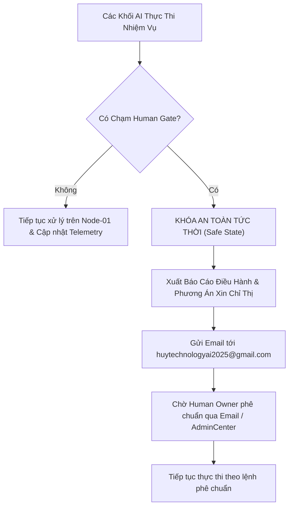

# HUY AI CENTER — BẢN ĐIỀU HÀNH PHÂN CÔNG TÁC VỤ ĐA KHỐI & GIAO THỨC HUMAN GATE

**Số hiệu văn bản:** `DIRECTIVE-2026-0928-AUTONOMOUS-DISPATCH-V1`  
**Ngày ban hành:** 28/09/2026  
**Chủ thể phê duyệt (Root of Trust):** Human Owner (`L0-OWNER`)  
**Email nhận báo cáo & phê duyệt chỉ thị:** `huytechnologyai2025@gmail.com`  
**Cổng quản trị thời gian thực:** [https://www.huycncdsai.io.vn/admincenter](https://www.huycncdsai.io.vn/admincenter)  
**Trụ sở hạ tầng dữ liệu:** Dell Precision M4800 (`huy-node01` @ `100.79.240.108`)  
**Trạm điều khiển từ xa:** Lenovo ThinkPad (`REMOTE_CONTROL_PLANE_ONLY`, 0 Byte lưu trữ)

---

## 1. PHÂN CÔNG NHIỆM VỤ 6 KHỐI AI AGENCY TIẾP TỤC BUILD HỆ THỐNG

Toàn bộ 6 Khối Nghiệp vụ (59 AI Agency) đã được nạp chỉ thị tác chiến chính thức vào **Swarm Telemetry Engine** và hàng đợi **PGMQ** trên Node-01:

| Khối Nghiệp Vụ (BU) | Chỉ Huy Trưởng (Lead) | Lực Lượng | Nhiệm Vụ Trọng Tâm Tiếp Tục Build | Trạng Thái |
| :--- | :--- | :--- | :--- | :--- |
| **BU-01: Khối Kỹ Thuật (HUY TECHNOLOGY AI)** | `L2-P01` (Head of AI R&D) | 4 Kỹ sư cốt lõi (`L3-M01` đến `L3-M04`) | Xây dựng Core API Service Engine & Adapter kết nối LLM cục bộ trên Node-01 (`Qwen 2.5 Coder 32B On-Prem`); Tối ưu hóa API caching và microservices Next.js. | `ACTIVE` |
| **BU-02: Khối Sản Phẩm (HUY AI SCHOOL)** | `L2-P02` (Head of EdTech) | 3 Chuyên gia (`L3-M05` đến `L3-M07`) | Soạn thảo ma trận chương trình đào tạo "Kỹ sư Tác tử AI Độc lập 2026", thiết kế phòng thực hành Interactive Prompt Laboratory và kho giáo trình tự động. | `ACTIVE` |
| **BU-03: Khối Marketing & Tăng Trưởng** | `L2-P03` (Head of Growth) | 3 Chuyên gia (`L3-M08` đến `L3-M10`) | Thiết lập mạng lưới Topic Clusters 500 bài viết SEO ngành EdTech AI, xây dựng phễu thu hút học viên tự nhiên (Organic Funnel) và tối ưu tỷ lệ chuyển đổi. | `ACTIVE` |
| **BU-04: Khối Vận Hành OPS (Dell Node-01)** | `L2-P04` (Head of Infra) | 3 SRE (`L3-M11`..`M13`) & 4 Security Nodes (`SEC-01`..`04`) | Giám sát 24/7 máy chủ Dell M4800 (`100.79.240.108`), khóa cứng phân vùng `/mnt/data2` (**R4 PROTECTED**), bảo đảm toàn vẹn 3 gói dữ liệu di trú và hàng đợi PGMQ. | `ACTIVE (SRE)` |
| **BU-05: Khối Tài Chính & Tuân Thủ** | `L2-P05` (Head of Legal) | 2 Chuyên gia (`L3-M14`, `L3-M15`) | Thiết lập khung pháp lý bản quyền sở hữu trí tuệ tác nhân AI và bộ quy tắc kiểm toán tuân thủ thuế số SmartTax Vietnam. | `ACTIVE` |
| **BU-06: Ban Điều Hành & Dự Phòng Toàn Cầu** | `L1-P01` (HAIP Master Dispatcher) | 14 Tác tử dự phòng (`RESERVE-01` đến `RESERVE-14`) | Điều phối nhịp tim A2A Event Bus, duy trì 14 AI ở trạng thái Warm/Cold Standby, sẵn sàng chi viện tức thời khi có sự cố mà không tiêu hao quota. | `STANDBY_ARMED` |

---

## 2. CƠ CHẾ TIẾT KIỆM QUOTA & BỘ TỔNG HỢP TRUNG TÂM (CENTRAL AGGREGATOR)

Nhằm tuân thủ tuyệt đối chỉ thị **tiết kiệm quota đám mây**:
1. **Vai trò Agent Trung Tâm (Antigravity):**
   * Hoạt động theo cơ chế **Chỉ Huy Bất Đồng Bộ (Asynchronous Event-Driven Aggregator)**.
   * Không sinh token đàm thoại dư thừa, không thăm dò liên tục dạng polling tốn kém.
   * Tiếp nhận các bản tin trạng thái (Telemetry Heartbeats) được nén gọn từ các Khối qua PGMQ Message Bus.
2. **Tận dụng Compute Cục bộ trên Dell Precision M4800 (Node-01):**
   * Các tác vụ nặng về tính toán, lập trình và xử lý dữ liệu được ưu tiên đẩy về mô hình local `Qwen 2.5 Coder 32B On-Prem` trên Node-01.
   * Tỷ lệ tiêu hao quota đám mây (Anthropic, OpenAI, Vertex) duy trì ở mức tối thiểu (`0% hao phí ngoài ý muốn`).

---

## 3. GIAO THỨC HUMAN GATE VÀ QUY TRÌNH BÁO CÁO QUA EMAIL

Hệ thống thiết lập **4 Cổng Kiểm Soát Bắt Buộc Của Con Người (Human Gates)**. Khi bất kỳ cổng nào chạm điều kiện kích hoạt, mọi tiến trình tự động phải **dừng lại ngay lập tức** và xuất báo cáo xin chỉ thị:

### Danh mục 4 Human Gate Bất Khả Xâm Phạm:
1. **HG-01 (Authoritative Cutover Node-01):**
   * *Điều kiện kích hoạt:* Chuyển đổi toàn bộ thẩm quyền lưu trữ và DNS sang Node-01 độc lập hoàn toàn.
   * *Hành động bắt buộc:* Dừng lại, lập báo cáo đối chiếu Hash SHA-256 dữ liệu và gửi mail xin lệnh cắt chuyển.
2. **HG-02 (Cloud API Paid Quota Expansion):**
   * *Điều kiện kích hoạt:* Yêu cầu mở rộng hạn ngạch API trả phí vượt quá ngưỡng an toàn thử nghiệm.
   * *Hành động bắt buộc:* Dừng lại, tính toán bảng dự toán chi phí và gửi mail xin duyệt ngân sách.
3. **HG-03 (Financial & Commercial Settlement):**
   * *Điều kiện kích hoạt:* Bắt đầu kích hoạt luồng thanh toán thực tế hoặc kết nối cổng ngân hàng/SmartTax.
   * *Hành động bắt buộc:* Dừng lại, xin chỉ thị cấu hình tài khoản thụ hưởng từ Human Owner.
4. **HG-04 (Core Architectural Mutation / Data Destruction):**
   * *Điều kiện kích hoạt:* Bất kỳ tác vụ nào có nguy cơ thay đổi lược đồ cơ sở dữ liệu gốc hoặc can thiệp vùng bảo vệ `/mnt/data2`.
   * *Hành động bắt buộc:* Đóng băng khẩn cấp, xuất biên bản an toàn xin chữ ký điện tử của Human Owner.

---

## 4. ĐỊA CHỈ & KÊNH GIAO TIẾP DUY NHẤT ĐƯỢC ỦY QUYỀN

* **Email tiếp nhận báo cáo & phê chuẩn:** `huytechnologyai2025@gmail.com`
* **Tiêu đề email chuẩn hóa:** `[HUY AI CENTER] [HUMAN GATE HG-XX] BÁO CÁO XIN CHỈ THỊ TỪ ROOT OF TRUST`
* **Trang giám sát trực quan:** [huycncdsai.io.vn/admincenter](https://www.huycncdsai.io.vn/admincenter)
