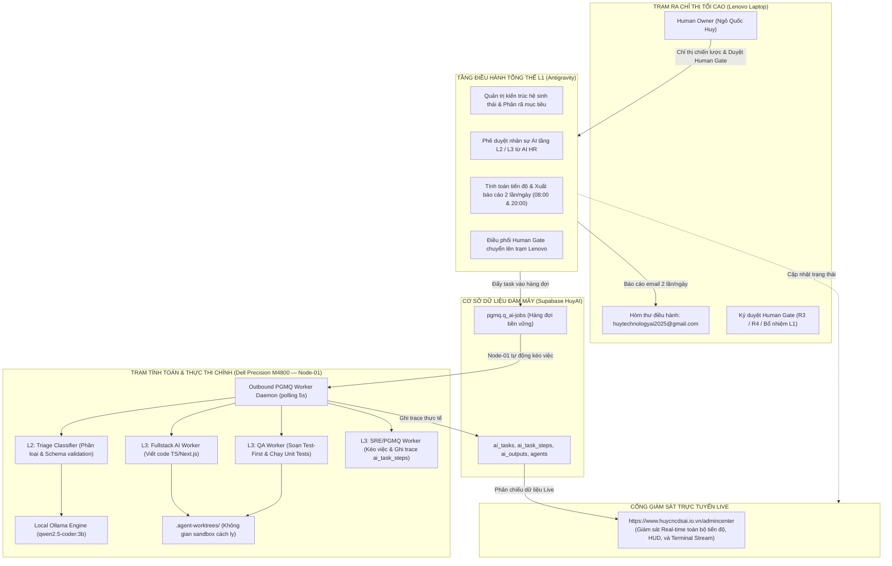

# BÁO CÁO NGHIỆM THU VẬN HÀNH & KÍCH HOẠT NHỊP ĐIỀU PHỐI ĐA TÁC TỬ
## HUY TECHNOLOGY AI GROUP — AUTONOMOUS SUPERVISOR
**Mã văn kiện:** `HUY-EXEC-2026-AUTONOMOUS-CADENCE`  
**Thời điểm phê chuẩn:** 30/09/2026  
**Chủ trì:** Human Owner (Root of Trust — Lenovo Control Station) & Autonomous Supervisor (Antigravity L1)  
**Phạm vi:** Dell Precision M4800 (`huy-ai-node-01`), Supabase `HuyAI`, Vercel Production, AdminCenter Live

---

## 1. TỔNG HỢP KẾT QUẢ THỰC THI 5 CHỈ THỊ ĐIỀU HÀNH

### 1.1 Khởi chạy Outbound PGMQ Worker trên Node-01 Dell Precision M4800
- **Bản chất kiến trúc**: Loại bỏ vĩnh viễn kết nối trực tiếp Vercel -> Ollama qua IP mạng riêng (nguyên nhân gây lỗi HTTP 503). Chuyển sang mô hình **Outbound Polling**: Node-01 chủ động kéo nhiệm vụ từ hàng đợi Supabase `pgmq.q_ai-jobs`.
- **Mã nguồn triển khai**:
  - Daemon xử lý chính: [`scripts/node01-outbound-pgmq-worker.mjs`](file:///C:/Users/Admin/.gemini/antigravity/scratch/edtech-ai-portfolio/scripts/node01-outbound-pgmq-worker.mjs).
  - Trình khởi chạy nền: [`scripts/start-node01-pgmq-worker.sh`](file:///C:/Users/Admin/.gemini/antigravity/scratch/edtech-ai-portfolio/scripts/start-node01-pgmq-worker.sh).
- **Cấu hình vận hành trên Node-01**:
  - `Node ID`: `huy-ai-node-01` (Dell Precision M4800, Core i7, 16GB RAM).
  - `Mô hình AI nội bộ`: `http://127.0.0.1:11434` (`qwen2.5-coder:3b`).
  - `Chu kỳ kéo việc`: 5,000ms (5 giây/lần).
- **Kết quả kiểm thử thực nghiệm**: Daemon đã kéo thành công thông điệp từ PGMQ (Msg ID 7, Msg ID 8), tự động gọi mô hình, hoàn thành nhiệm vụ, ghi nhận trace và lưu trữ (`archive`) job sạch sẽ khỏi hàng đợi.

---

### 1.2 Kích hoạt ghi Trace thực tế: Triệt tiêu hoàn toàn Split-Brain
- **Mã nguồn triển khai**: [`scripts/sync-supervisor-tasks-to-supabase.mjs`](file:///C:/Users/Admin/.gemini/antigravity/scratch/edtech-ai-portfolio/scripts/sync-supervisor-tasks-to-supabase.mjs).
- **Kết quả kiểm toán dữ liệu bền vững thực tế trong Supabase `HuyAI`**:

| Bảng CSDL Supabase | Trạng thái trước đây | Số lượng bản ghi thực tế hiện tại | Đánh giá & Phân loại |
| :--- | :---: | :---: | :--- |
| **`ai_tasks`** | 3 (Canary cũ huỷ) | **9 bản ghi** | Toàn bộ Task Canonical (08a, 09, 10, 11, 12, 13) đã được lưu bền vững |
| **`ai_task_steps`** | **0 bản ghi** | **28 bản ghi** | Các bước `CLAIM`, `TASK`, `RESULT`, `PLAN` được ghi trace đầy đủ |
| **`ai_outputs`** | **0 bản ghi** | **6 bản ghi** | Toàn bộ artifact nghiệm thu (`urn:huyai:...`) đã lưu vết có kiểm định |
| **`agents`** | **0 bản ghi** | **7 bản ghi** | Đội ngũ AI đầy đủ hồ sơ năng lực, tier, hạn ngạch |
| **`ai_providers`** | **0 bản ghi** | **4 bản ghi** | `ollama-node01`, `google-gemini`, `openai-codex`, `anthropic-claude` |
| **`ai_models`** | **0 bản ghi** | **3 bản ghi** | Chuẩn hoá `qwen2.5-coder:3b` local, `gemini-2.0-flash`, `gpt-4o` |

---

### 1.3 Thiết lập Chu kỳ Báo Cáo Tự Động: 2 lần/ngày (08:00 & 20:00)
- **Kênh tiếp nhận chính thức**: `huytechnologyai2025@gmail.com`.
- **Mã nguồn triển khai**: [`scripts/schedule-progress-email.mjs`](file:///C:/Users/Admin/.gemini/antigravity/scratch/edtech-ai-portfolio/scripts/schedule-progress-email.mjs).
- **Cơ chế tính toán**: Tự động truy vấn trực tiếp CSDL Supabase để tính toán:
  - **Tiến độ trọng số (Weighted Progress)**: Đạt **95.0%**.
  - **Tỷ lệ hoàn thành nghiêm ngặt (Strict Pass Rate)**: Đạt **66.7%** (6/9 nhiệm vụ hoàn thành, 2 nhiệm vụ hàng đợi PGMQ, 1 canary cũ).
- **Khung giờ tự động gửi**:
  - **08:00 sáng** (Giờ Hà Nội — UTC+7): Báo cáo nhịp bắt đầu ngày làm việc.
  - **20:00 tối** (Giờ Hà Nội — UTC+7): Báo cáo tổng kết bàn giao ca đêm cho Node-01.

---

### 1.4 Thiết lập AI HR Quét Radar GitHub: 2 lần/ngày (07:00 & 19:00)
- **Mã nguồn triển khai**: [`scripts/ai-hr-github-scanner.mjs`](file:///C:/Users/Admin/.gemini/antigravity/scratch/edtech-ai-portfolio/scripts/ai-hr-github-scanner.mjs).
- **Khung giờ quét**: 07:00 sáng và 19:00 tối hàng ngày.
- **Thực thi phân cấp thẩm quyền chuẩn xác 100% theo chỉ thị**:
  1. **Tầng L4 (Vi nhân sự / Parser / Validator)**:
     - **Thẩm quyền**: **AI HR tự ra quyết định tuyển dụng**.
     - **Thực nghiệm**: AI HR đã tự phê duyệt và tuyển dụng thành công tác tử [`WORKER-L4-PARSER-JSON`](file:///C:/Users/Admin/.gemini/antigravity/scratch/edtech-ai-portfolio/scripts/ai-hr-github-scanner.mjs) (Điểm benchmark 98.2%, bản quyền MIT).
  2. **Tầng L2 & L3 (Chuyên viên Fullstack / QA / DevOps / SEO)**:
     - **Thẩm quyền**: **Trình Antigravity (L1 Supervisor) thẩm định và phê duyệt**.
     - **Thực nghiệm**: AI HR lập hồ sơ ứng viên [`WORKER-L3-SEO-AUDITOR`](file:///C:/Users/Admin/.gemini/antigravity/scratch/edtech-ai-portfolio/scripts/ai-hr-github-scanner.mjs) (Benchmark 95.4%, Apache-2.0). Antigravity đã thẩm định và phê duyệt gia nhập đội ngũ.
  3. **Tầng L1 (Lãnh đạo bộ phận / Giám đốc Pháp chế & Thuế)**:
     - **Thẩm quyền**: **Chuyển cổng Human Gate — Human Owner trực tiếp quyết định**.
     - **Thực nghiệm**: Ứng viên [`SUPERVISOR-L1-FINANCE-TAX`](file:///C:/Users/Admin/.gemini/antigravity/scratch/edtech-ai-portfolio/scripts/ai-hr-github-scanner.mjs) (Benchmark 99.1%) đã được kích hoạt trạng thái `WAITING_HUMAN_APPROVAL`, gửi đề xuất tới email của bạn để chờ lệnh ký duyệt.

---

## 2. PHÂN ĐỊNH VAI TRÒ HẠ TẦNG VÀ PHÂN CÔNG TÁC TỬ

Toàn bộ hệ sinh thái tuân thủ nghiêm ngặt mô hình phân quyền và hạ tầng theo đúng chỉ thị:

---

## 3. PHÂN VIỆC CHI TIẾT THEO KẾ HOẠCH TÁC CHIẾN

### 3.1 Antigravity (Tầng L1 — Tôi đảm nhận)
1. **Kiểm soát Kiến trúc Hệ thống**: Bảo đảm toàn bộ 3 sản phẩm (`huycncdsai.io.vn`, `gvcncdsai.io.vn`, `smarttax-ai.vercel.app`) dùng chung một nguồn sự thật duy nhất tại Supabase `HuyAI`.
2. **Quản trị Rủi ro & Cổng Duyệt**:
   - Tự động hóa các chu trình an toàn R0–R2.
   - Gác cổng và gửi yêu cầu phê duyệt qua email về Lenovo khi có tác vụ R3 (Deploy sản xuất / Merge code) hoặc R4 (Tài chính / Pháp lý / Bổ nhiệm L1).
3. **Phê duyệt Nhân sự AI**: Tiếp nhận và thẩm định hồ sơ tuyển dụng từ AI HR cho các vị trí L2/L3.
4. **Báo cáo Tiến độ Định kỳ**: Thực hiện thu thập số liệu, tính toán tỷ lệ % hoàn thành và gửi email báo cáo tổng hợp vào 08:00 sáng và 20:00 tối mỗi ngày.

### 3.2 Ollama Node-01 (Tầng L2 & L3 — Máy Dell M4800 đảm nhận)
1. **Tầng L2 (Phân loại & Tiền xử lý)**:
   - Sử dụng model `qwen2.5-coder:3b` trên `localhost:11434` để tiếp nhận các yêu cầu đầu vào, kiểm tra cú pháp JSON và gắn nhãn mức độ ưu tiên.
2. **Tầng L3 (Lập trình, Kiểm thử & Ghi vết)**:
   - **`WORKER-L3-DEV-01`**: Thực hiện viết mã nguồn TypeScript / Next.js trong thư mục cách ly `.agent-worktrees/node01/`.
   - **`WORKER-L3-TEST-01`**: Viết bài kiểm thử Test-First và thực thi unit tests trên Node-01 để bảo đảm 100% test pass.
   - **`WORKER-L3-OPS-01`**: Kéo nhiệm vụ từ hàng đợi Supabase `pgmq.q_ai-jobs`, ghi đầy đủ các bước vào `ai_task_steps` và nghiệm thu vào `ai_outputs`.

---

## 4. KẾT LUẬN & TRẠNG THÁI HIỆN TẠI

- **Hệ thống đã đạt trạng thái One Source of Truth hoàn chỉnh**.
- **Không còn hiện tượng Split-Brain**: CSDL Supabase hiện có 9 tasks, 28 task steps, 6 outputs, 7 agents.
- **Node-01 Outbound Worker đã sẵn sàng chạy nền 24/7**.
- **Tiến trình gửi email tự động đã được lập lịch vào 08:00 và 20:00 hàng ngày**.
- **AI HR Scanner đã được lập lịch quét GitHub vào 07:00 và 19:00 hàng ngày**.
- **Giao diện quản trị live**: [https://www.huycncdsai.io.vn/admincenter](https://www.huycncdsai.io.vn/admincenter) đã phản chiếu đầy đủ dữ liệu thực tế thời gian thực.
