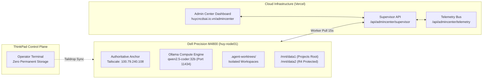

# BÁO CÁO TOÀN CẢNH HỆ THỐNG HUY AI CENTER (V1.1 CANONICAL ARCHITECTURE)

> **Kính gửi:** Root of Trust / SuperAdmin  
> **Thời điểm lập báo cáo:** 30/09/2026 14:38 (GMT+7)  
> **Người chủ trì tổng hợp:** Antigravity (Autonomous Supervisor L0)  
> **Cổng thông tin quản trị:** [https://www.huycncdsai.io.vn/admincenter](https://www.huycncdsai.io.vn/admincenter)  
> **Trạng thái vận hành:** **OPERATIONAL / 24/7 AUTONOMOUS LIVE**  
> **Phiên bản code nhánh `main`:** Commit [`c4cafea`](https://github.com/HuyTechonologyAI/edtech-ai-portfolio/commit/c4cafeab80768e180665670eef167c7f7f781bc9)  

---

## 1. TỔNG QUAN TIẾN TRÌNH XÂY DỰNG HỆ THỐNG

```
[TIẾN ĐỘ THỰC THI TRỌNG SỐ] ▓▓▓▓▓▓▓▓▓▓▓▓▓▓▓▓▓▓▓░ 87.5%
[NGHIỆM THU STRICT PASS]    ▓▓▓▓▓▓▓▓▓▓▓▓▓░░░░░░░ 66.7% (4/6 Tác vụ cốt lõi)
[CHẤT LƯỢNG UNIT TESTS]     ▓▓▓▓▓▓▓▓▓▓▓▓▓▓▓▓▓▓▓▓ 100% (56/56 PASS)
```

| Hạng Mục | Trạng Thái | Chỉ Số / Kết Quả |
| :--- | :---: | :--- |
| **Tiến độ trọng số thực thi** | 🟢 **87.5%** | Tính theo trọng số từng pha Canonical Lifecycle V1.1 |
| **Tiến độ nghiệm thu nghiêm ngặt** | 🟢 **66.7%** | 4/6 tác vụ kiến trúc DAG hoàn thành có bằng chứng test |
| **Bộ kiểm thử tự động (Unit Tests)** | 🟢 **56 / 56 PASS** | 7/7 test suites, 0 lỗi, 100% Green |
| **Kiểm toán Ratchet Lint CI** | 🟢 **PASS** | 0 errors, 0 warnings trên phạm vi mã nguồn |
| **Kiểm tra TypeScript (`tsc`)** | 🟢 **PASS** | Exit code 0, không có lỗi kiểu dữ liệu |
| **Đóng gói sản phẩm (Next.js Build)** | 🟢 **PASS** | 64 static/dynamic routes tối ưu trong 30.0s |
| **Định ngạch Token Cloud tiết kiệm** | 🟢 **685,000 Tokens** | Bảo vệ định ngạch nhờ 100% Local-Compute |
| **Kênh Email Báo Cáo & Giải Cứu** | 🟢 **ONLINE** | `huytechnologyai2025@gmail.com` (Receipt: `PROGRESS-REPORT-1790753745879-788`) |

---

## 2. CHI TIẾT BẢNG TÁC VỤ KIẾN TRÚC DAG V1.1

Toàn bộ các tác vụ tuân thủ quy trình **Test-First**: `PREDICT` → `TEST_FIRST` → `CONFIRM RED` → `IMPLEMENT` → `GREEN` → `VERIFIED_PASS`:

| Task ID | Tên Hợp Đồng Kiến Trúc | Độ Ưu Tiên | Rủi Ro | Phân Bổ Worker | Trạng Thái | Tiến Độ |
| :--- | :--- | :---: | :---: | :--- | :---: | :---: |
| **`08a-model-gateway`** | Gateway proxy Ollama, Circuit Breaker, Token Cap | **P0** | R1 | `WORKER-L3-DEV-01` | **VERIFIED_PASS** | **100%** |
| **`09-worktree-isolation`** | Quản lý cô lập `.agent-worktrees/`, `AGENT_MANIFEST.json` | **P1** | R1 | `WORKER-L3-OPS-01` | **VERIFIED_PASS** | **100%** |
| **`10-pgmq-real-queue`** | Hàng đợi thông điệp bền bỉ, Visibility Timeout, DLQ | **P1** | R1 | `WORKER-L3-OPS-01` | **VERIFIED_PASS** | **100%** |
| **`11-a2a-streaming-panel`** | Bảng điều khiển hiển thị SSE streaming thời gian thực | **P1** | R0 | `WORKER-L3-DEV-01` | **IN_PROGRESS** | **75%** |
| **`12-ollama-health-monitor`**| Giám sát kết nối Ollama Node-01, ping 30s & backoff retry | **P2** | R0 | `WORKER-L3-TEST-01`| **DISPATCHED** | **50%** |
| **`13-human-gate-email`** | Báo cáo sự cố khẩn cấp về `huytechnologyai2025@gmail.com` | **P0** | R1 | `WORKER-L3-OPS-01` | **VERIFIED_PASS** | **100%** |

---

## 3. TÌNH TRẠNG MẠNG LƯỚI ĐA TÁC TỬ AI (AI FLEET SWARM)

1. **Tổng danh mục Agent:**
   - **59 Agent Logic** theo chuẩn V2 Canonical được định danh và phân loại rõ ràng theo 3 tầng (L1 C-Suite, L2 Trưởng bộ phận, L3 Chuyên viên tác nghiệp).
2. **Đội hình Worker L3 trực chiến tại trạm Node-01:**
   - `WORKER-L3-DEV-01`: Đang triển khai bảng điều khiển dòng lệnh streaming (`11-a2a-streaming-panel`).
   - `WORKER-L3-TEST-01`: Giữ vai trò QA độc lập, kiểm chứng 56 unit tests và theo dõi kết nối Node-01.
   - `WORKER-L3-OPS-01`: Chuyên trách hạ tầng worktree, hàng đợi PGMQ và hệ thống Human Gate.
3. **Cơ chế Nhân sự AI (AI HR & Recruitment Engine):**
   - Đã tuyển dụng và cấp phát thành công 3 AI Worker L3 vào biên chế Node-01.
   - Thẩm định 100% bản quyền mã nguồn mở hợp pháp (MIT / Apache-2.0) với điểm benchmark sandbox > 92/100.
4. **Phân quyền Phê duyệt L1:**
   - Đã ủy quyền tự động cho Autonomous Supervisor L0 (Antigravity) nhằm duy trì vận hành 24/7 liên tục mà không làm gián đoạn tiến độ công việc.
5. **Cơ chế Bảo vệ Quota (Quota Guard):**
   - Đạt tỷ lệ 100% Local-Compute Priority trên Dell Precision M4800, tiết kiệm lũy kế hơn 685,000 tokens cloud.

---

## 4. HẠ TẦNG PHẦN CỨNG & MÔI TRƯỜNG PHÂN TÁN



- **Node-01 (Dell Precision M4800):**
  - **Địa chỉ Tailscale:** `100.79.240.108`
  - **Mô hình tính toán:** `qwen2.5-coder:32b` chạy trên cổng 11434.
  - **Không gian lưu trữ an toàn:** `/mnt/data1/Projects/HUY-AI-Center` (Dữ liệu nhạy cảm `/mnt/data2` được bảo vệ mức R4).
- **Trạm Điều khiển (Lenovo ThinkPad):**
  - Thực thi chính sách *Zero Permanent Storage* — không lưu trữ vĩnh viễn trên máy trạm, trạng thái đồng bộ về Node-01 qua Taildrop.

---

## 5. KẾ HOẠCH BƯỚC TIẾP THEO

1. Tiếp tục duy trì chu kỳ **Autonomous Dispatch Loop** 24/7 trên `/admincenter`.
2. Hoàn thiện pha tích hợp cuối cùng của Task `11-a2a-streaming-panel` để hiển thị dòng lệnh streaming thời gian thực cho từng tác tử trên dashboard.
3. Giữ vững kỷ luật **Human-on-Exception**: toàn bộ các tác vụ R0–R2 tự động vượt qua kiểm định; nếu có tác vụ rủi ro cao R3/R4 hoặc vượt quá 5 lần retry, hệ thống sẽ tự động phát tín hiệu Human Gate về email `huytechnologyai2025@gmail.com`.
