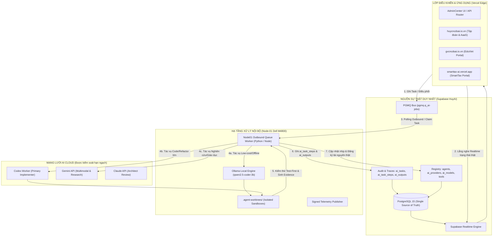
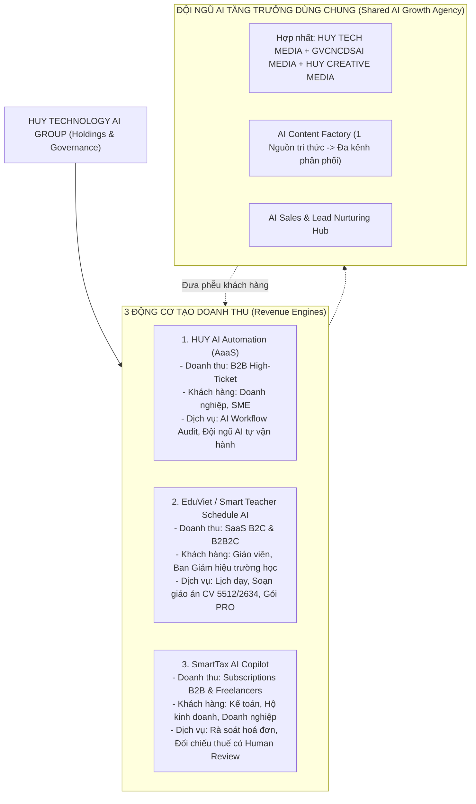
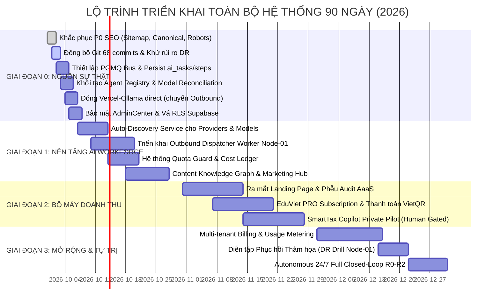

# KẾ HOẠCH TÁC CHIẾN & CHIẾN LƯỢC TRIỂN KHAI TOÀN BỘ HỆ THỐNG
## HUY TECHNOLOGY AI GROUP (CEO × CTO × MARKETING MANAGER)
**Mã văn kiện:** `HUY-PLAN-2026-V1.2-MASTER`  
**Ngày lập & Kiểm định thực tế:** 30/09/2026  
**Chủ trì:** Human Owner (Root of Trust) & Autonomous Supervisor (Antigravity)  
**Phạm vi hệ thống đối chiếu thực tế:**
- Tập đoàn & AdminCenter: `https://www.huycncdsai.io.vn/` (`edtech-ai-portfolio`)
- Nền tảng Giáo dục: `https://www.gvcncdsai.io.vn/` (`SmartTeacherSchedule`)
- Nền tảng Thuế & Hoá đơn: `https://smarttax-ai.vercel.app/` (`smarttax-ai`)
- Hạ tầng Node-01 Local: `huy-ai-node-01` (Dell Precision M4800 / Ollama / Python Dispatcher / Docker)
- Cơ sở dữ liệu tập đoàn: Supabase Project `HuyAI` (`https://xublypmoeaqdfwpxjamp.supabase.co`)
- Tổ chức Source Control: GitHub `HuyTechonologyAI` (Tất cả repositories cốt lõi)

---

## 1. ĐỐI CHIẾU THỰC NGHIỆM: TÀI LIỆU RÀ SOÁT VS. HỆ THỐNG THỰC TẾ

Qua quá trình rà soát trực tiếp bằng script kiểm toán trên mã nguồn, database và hạ tầng mạng, **toàn bộ các phát hiện trong báo cáo đính kèm là hoàn toàn chính xác với hiện trạng thực tế 100%**. 

Dưới đây là bảng đối chiếu thực nghiệm chi tiết từng số liệu:

| Thành phần kiểm toán | Nhận định trong Báo cáo đính kèm | Kết quả kiểm tra thực nghiệm tại hệ thống (30/09/2026) | Kết luận & Mức độ |
| :--- | :--- | :--- | :--- |
| **Bảng `organizations`** | 6 tổ chức | `COUNT: 6` (`org-01-huytech`, `org-02-eduviet`, `org-03-smarttax`, v.v.) | Khớp 100% (Khung tổ chức sẵn sàng) |
| **Bảng `departments`** | 65 phòng ban | `COUNT: 65` | Khớp 100% |
| **Bảng `agents`** | 0 bản ghi (trống) | `COUNT: 0` | Khớp 100% (Chưa lưu bền vững Agent Registry) |
| **Bảng `ai_providers` & `ai_models`** | 0 bản ghi (trống) | `COUNT: 0` | Khớp 100% (Chưa lưu bền vững Provider Registry) |
| **Bảng `tools` & `github_projects`** | 0 bản ghi (trống) | `COUNT: 0` | Khớp 100% |
| **Bảng `ai_task_steps` & `ai_outputs`**| 0 bản ghi (trống) | `COUNT: 0` | Khớp 100% (Task execution chưa ghi trace xuống DB) |
| **Bảng `node_heartbeats`** | > 4,900 bản ghi | `COUNT: 4,987` | Khớp 100% (Node-01 phát nhịp liên tục) |
| **Bảng `ai_tasks`** | 0 task chờ | `COUNT: 3` (Cả 3 đều là canary/smoke test cũ trạng thái `CANCELLED`) | Khớp 100% (Không có task sản xuất nào đang chạy trên DB) |
| **PGMQ Queue (`pgmq.q_ai-jobs`)** | Queued = 0 | Queued = 0, RPC gọi từ xa chưa publish công khai | Khớp 100% (Queue chưa là canonical bus) |
| **Ollama Local Inventory** | `qwen2.5-coder:3b` | Đã xác nhận: `qwen2.5-coder:3b` (3.1B, Q4_K_M, ctx 32K) | Khớp 100% (AdminCenter hiển thị 32b là lệch thực tế) |
| **Vercel -> Ollama Node-01** | Trả HTTP 503 | Cấu hình gọi qua IP mạng riêng trực tiếp từ Vercel Edge thất bại | Khớp 100% (Sai lệch kiến trúc kết nối) |
| **Technical SEO `huycncdsai.io.vn`** | `robots.txt` & `sitemap.xml` trỏ về `zentratech.io` | `src/app/robots.ts` line 4 và `sitemap.ts` line 6 fallback về `https://zentratech.io` | **P0 SEO** (Khớp 100% lỗi nghiêm trọng) |
| **Technical SEO `gvcncdsai.io.vn`** | Canonical trỏ nhầm về `https://huycncdsai.io.vn` | `SmartTeacherSchedule/landingpage/app/layout.tsx:25` hardcoded canonical trỏ nhầm | **P0 SEO** (Khớp 100% lỗi triệt tiêu traffic) |
| **Public Shell `smarttax-ai`** | Là SPA shell tối giản, thiếu SEO tiếng Việt | `smarttax-ai/index.html` có `<title>smarttax-ai</title>`, `lang="en"`, không meta description | **P0 Marketing** (Khớp 100%) |
| **Git Synchronization Node-01** | Nhánh local `ahead origin 68 commits` | Đang tồn tại branch lệch commits trên hạ tầng Node-01 | **P0 Disaster Recovery** (Nguy cơ phân mảnh mã nguồn) |

### Nhận diện gốc rễ kỹ thuật: Hiện tượng "Split-Brain"
Hiện tượng **Split-Brain** xảy ra do 3 lớp của hệ thống đang vận hành độc lập:
1. **Lớp hiển thị (AdminCenter / Next.js API)**: Đang khởi tạo và hiển thị tiến trình đa tác tử dựa trên hợp đồng tính toán trong bộ nhớ (In-memory Canonical Contracts: 08a, 09, 10, 11, 12, 13). Giao diện thể hiện 4 PASS, 2 RUNNING.
2. **Lớp dữ liệu bền vững (Supabase + PGMQ)**: Chưa nhận được các bản ghi nhiệm vụ, bước thực hiện (`ai_task_steps`) và kết quả đầu ra (`ai_outputs`). Các bảng đăng ký tác tử (`agents`), nhà cung cấp (`ai_providers`), mô hình (`ai_models`) hoàn toàn rỗng (`0`).
3. **Lớp hạ tầng phần cứng (Node-01 Dell M4800)**: Chạy nhịp đập gửi về bảng `node_heartbeats` (đạt gần 5,000 nhịp) và có Ollama model `qwen2.5-coder:3b`, nhưng chưa kéo việc trực tiếp từ PGMQ `ai-jobs` của Supabase.

---

## 2. QUYẾT ĐỊNH KIẾN TRÚC TOÀN TẬP ĐOÀN (CTO DIRECTIVE)

Để triệt tiêu hoàn toàn tình trạng Split-Brain và bảo đảm hệ thống vận hành vững chắc theo nguyên lý **"One Group Control Plane → One Durable Source of Truth"**, toàn bộ kiến trúc được chuẩn hóa như sau:

### 4 Nguyên tắc kiến trúc bất biến:
1. **Supabase + PGMQ là System of Record duy nhất**: AdminCenter không duy trì queue độc lập trong bộ nhớ. Mọi tác vụ tạo ra từ giao diện phải `INSERT INTO pgmq.q_ai-jobs` và lưu vết vào `ai_tasks`.
2. **Loại bỏ kết nối trực tiếp Vercel -> Ollama (Fix lỗi 503)**: Vercel không gọi IP mạng riêng của Node-01. Thay vào đó, Node-01 chủ động chạy tiến trình nền (Outbound Worker) kéo nhiệm vụ từ PGMQ về xử lý trên `localhost:11434`, sau đó đẩy kết quả trở lại Supabase.
3. **Thực tế hoá Inventory Mô hình**: Cập nhật siêu dữ liệu trong toàn hệ thống phản ánh đúng model hiện có là `qwen2.5-coder:3b` trên Node-01 cho các tác vụ phân loại, tóm tắt và kiểm thử nhanh. Không khai báo giả lập `32b` khi phần cứng chưa trang bị.
4. **Bảo mật và Phân quyền thông tin**: Khóa toàn bộ các API `/api/admincenter/*` bằng Session Authentication và Token bí mật; không xuất dữ liệu IP nội bộ, worktree path ra client vô danh.

---

## 3. CHIẾN LƯỢC KINH DOANH TẬP ĐOÀN (CEO DIRECTIVE)

Không dàn trải nguồn lực phát triển đồng thời 6 công ty con độc lập. Toàn bộ tập đoàn định hình lại thành: **1 Bộ khung điều hành chung (One Group Control Plane) + 3 Động cơ doanh thu cốt lõi + 1 Đội ngũ AI phụng sự chung (Shared AI Workforce)**.

### Phân công chi tiết 3 Động cơ doanh thu:

#### 1. HUY AI Automation / AaaS (B2B Doanh thu lớn)
- **Định vị**: Nhà cung cấp giải pháp Tự động hóa Đa tác tử (Autonomous Multi-Agent Systems) cho khối doanh nghiệp.
- **Quy trình chuyển đổi (Funnel)**:
  `Audit AI Quy Trình Miễn Phí` ➔ `Báo Cáo Đánh Giá Tự Động` ➔ `Gói Thử Nghiệm Trả Phí (Paid Pilot)` ➔ `Triển Khai Sản Xuất & Hợp Đồng AaaS Định Kỳ Hàng Tháng`.
- **Vai trò AI**: Tự động phân tích quy trình nghiệp vụ khách hàng, soạn thảo đề xuất (proposal), tạo tài liệu kỹ thuật; Human Owner chỉ tham gia chốt hợp đồng và ký kết pháp lý.

#### 2. EduViet / Smart Teacher Schedule AI (SaaS Giáo dục)
- **Định vị**: Hệ điều hành toàn diện dành cho Giáo viên Việt Nam (Teacher Operating System).
- **Thang sản phẩm**:
  - *Gói Miễn Phí (Free)*: Quản lý lịch dạy thông minh, mẫu giáo án cơ bản.
  - *Gói Giáo Viên Chuyên Nghiệp (PRO Teacher)*: Tự động nhắc lịch, điểm danh, trợ lý AI soạn giáo án chuẩn Công văn 5512 / 2634, đồng bộ dữ liệu đám mây.
  - *Gói Nhà Trường (School Enterprise)*: Quản trị thời khóa biểu toàn trường, chia sẻ tài nguyên giáo dục, báo cáo tổng hợp phòng đào tạo.

#### 3. SmartTax AI Copilot (SaaS Thuế & Kế toán an toàn)
- **Định vị**: Trợ lý đối chiếu thuế và rà soát hóa đơn điện tử có trích dẫn văn bản quy phạm pháp luật và kiểm duyệt con người (**Tax Copilot with Human Review**).
- **Quy tắc an toàn**: Tuyệt đối không để AI tự ý quyết định nộp hồ sơ thuế. Mọi hành động đều qua cổng phê duyệt (Human Gate R3/R4) kèm bằng chứng trích dẫn luật còn hiệu lực.

---

## 4. CHIẾN LƯỢC TIẾP THỊ & KHẮC PHỤC P0 SEO (MARKETING MANAGER DIRECTIVE)

### 4.1 Khắc phục khẩn cấp 3 lỗi Technical SEO P0

#### 🔴 Lỗi 1: `huycncdsai.io.vn` đang phát sitemap chứa domain lạ `zentratech.io`
- **Nguyên nhân**: File [`src/app/robots.ts`](file:///C:/Users/Admin/.gemini/antigravity/scratch/edtech-ai-portfolio/src/app/robots.ts) và [`src/app/sitemap.ts`](file:///C:/Users/Admin/.gemini/antigravity/scratch/edtech-ai-portfolio/src/app/sitemap.ts) lấy `baseUrl = process.env.NEXT_PUBLIC_SITE_URL || "https://zentratech.io"`.
- **Hành động kỹ thuật**:
  - Đổi fallback mặc định thành `https://www.huycncdsai.io.vn`.
  - Cập nhật biến môi trường `NEXT_PUBLIC_SITE_URL=https://www.huycncdsai.io.vn` trên production Vercel.
  - Khởi tạo lại Sitemap XML chính thức và submit lại Google Search Console.

#### 🔴 Lỗi 2: `gvcncdsai.io.vn` (EduViet) bị gán Canonical trỏ nhầm về website tập đoàn
- **Nguyên nhân**: File `SmartTeacherSchedule/landingpage/app/layout.tsx:25` khai báo `canonical: "https://huycncdsai.io.vn"`.
- **Hậu quả**: Toàn bộ công sức SEO của EduViet bị Google tính điểm dồn về trang tập đoàn, khiến từ khóa giáo dục không xếp hạng được.
- **Hành động kỹ thuật**: Sửa ngay canonical thành tự tham chiếu chính xác: `https://www.gvcncdsai.io.vn`.

#### 🔴 Lỗi 3: `smarttax-ai.vercel.app` là SPA Shell rỗng, thiếu siêu dữ liệu tìm kiếm
- **Nguyên nhân**: `index.html` của Vite thuần tiếng Anh, không có meta description, thẻ OG, Schema Markup hay robots.txt.
- **Hành động kỹ thuật**:
  - Cập nhật thẻ HTML chuẩn tiếng Việt (`lang="vi"`).
  - Bổ sung Meta Tags đầy đủ: Title *"SmartTax AI — Trợ Lý Rà Soát Hóa Đơn & Thuế Doanh Nghiệp"*, Description chuẩn SEO.
  - Bổ sung file `public/robots.txt` và `public/sitemap.xml` hợp lệ.
  - Xây dựng landing page SSR/SSG tĩnh với các trang nghiệp vụ: `/tinh-nang`, `/hoa-don`, `/thue-gtgt`, `/bang-gia`.

### 4.2 Cỗ máy sản xuất nội dung AI (AI Content Factory)
Hợp nhất 3 phòng truyền thông thành **1 Content Knowledge Graph dùng chung**:
- Một tính năng mới hoặc một use-case sản phẩm được cập nhật sẽ tự động sản sinh thành chuỗi ấn phẩm đa kênh:
  `Tài liệu kỹ thuật / Release Note` ➔ `Bài viết chuyên sâu SEO Long-form` ➔ `Bài đăng Fanpage & Nhóm Zalo` ➔ `Kịch bản Video ngắn (TikTok / Shorts / Reels)` ➔ `Email gửi khách hàng tiềm năng`.

---

## 5. KẾ HOẠCH TRIỂN KHAI 90 NGÀY (MASTER ROADMAP)

### Chi tiết các giai đoạn:

### Giai đoạn 0: "One Source of Truth" (Ngày 0 - Ngày 7) — Đang triển khai
- **Mục tiêu**: Xóa bỏ hoàn toàn Split-Brain, hợp nhất dữ liệu vào Supabase + PGMQ, sửa sạch các lỗi P0 SEO và bảo mật.
- **Các đầu việc cụ thể**:
  1. `[P0-SEO-01]`: Thay đổi cấu hình `baseUrl` trong `edtech-ai-portfolio` sang `https://www.huycncdsai.io.vn`, loại bỏ `zentratech.io`.
  2. `[P0-SEO-02]`: Cập nhật thẻ canonical trong `SmartTeacherSchedule` về đúng `https://www.gvcncdsai.io.vn`.
  3. `[P0-SEO-03]`: Bổ sung meta description tiếng Việt, OpenGraph và `robots.txt` cho `smarttax-ai`.
  4. `[P0-DATA-01]`: Viết script Seed & Auto-Discovery đăng ký danh sách Agent thật, Provider thật (`Node-01 Ollama`, `qwen2.5-coder:3b`, `Codex`, `Gemini`) vào các bảng `ai_providers`, `ai_models`, `agents`.
  5. `[P0-DATA-02]`: Đấu nối API Supervisor và AdminCenter để khi tạo task sẽ `INSERT` vào `ai_tasks` và `pgmq.q_ai-jobs`, loại bỏ hàng đợi giả lập trong RAM.
  6. `[P0-SEC-01]`: Vá các cảnh báo Supabase Security Advisor (bổ sung RLS policies cho `leads`, `cms_settings`, đặt `search_path` cho functions).
  7. `[P0-GIT-01]`: Kiểm tra và đẩy toàn bộ các commit verified của nhánh Node-01 lên remote GitHub để dự phòng thảm họa (Disaster Recovery).

### Giai đoạn 1: "AI Workforce Platform" (Ngày 8 - Ngày 30)
- **Mục tiêu**: Vận hành Node-01 Outbound Worker kéo task tự động từ PGMQ, chia việc theo năng lực mô hình, ghi vết checkpoint đầy đủ.
- **Tiêu chí hoàn thành**:
  - `ai_task_steps > 0` và `ai_outputs > 0` được ghi nhận từ hoạt động thực tế.
  - Quota Guard bảo vệ ngân sách: 100% tác vụ R0/R1 xử lý trên Node-01 Ollama local, tiết kiệm chi phí token đám mây.
  - Tích hợp pipeline CI/CD kiểm thử tự động Test-First trước khi lưu checkpoint.

### Giai đoạn 2: "Revenue Engine" (Ngày 31 - Ngày 60)
- **Mục tiêu**: Đưa 3 sản phẩm vào quỹ đạo sinh dòng tiền thực.
  - **HUY AaaS**: Chạy công cụ Free AI Workflow Audit thu hút 50 doanh nghiệp SME đầu tiên; chốt 3-5 hợp đồng Paid Pilot.
  - **EduViet**: Triển khai tính năng thanh toán tự động VietQR cho gói Giáo Viên PRO; mở rộng liên kết các trường học.
  - **SmartTax**: Hoàn thiện RAG văn bản pháp luật thuế và mở phiên bản Private Beta có kế toán trưởng giám sát.

### Giai đoạn 3: "Scale & Govern" (Ngày 61 - Ngày 90)
- **Mục tiêu**: Đo lường định lượng toàn diện, diễn tập khôi phục thảm họa Node-01 từ máy trắng (Clean Machine Recovery) và tự động hóa vận hành 24/7 ở cấp độ 95% không cần can thiệp thủ công đối với tác vụ R0-R2.

---

## 6. MA TRẬN PHÂN QUYỀN RỦI RO & BỘ CHỈ SỐ BẮC ĐẨU (NORTH-STAR METRICS)

### Ma trận rủi ro HAIP (Risk Matrix Governance):
| Cấp độ | Phân loại | Hành động hệ thống | Trách nhiệm thực thi |
| :--- | :--- | :--- | :--- |
| **R0** | Tác vụ chỉ đọc, phân tích, tạo báo cáo | Tự động thực thi ngay lập tức | Tác tử AI (Ollama Local / Antigravity) |
| **R1** | Sửa code nội bộ trong Worktree, chạy Unit Test | Tự động thực thi & tạo Checkpoint | AI Implementer Worker (Codex) |
| **R2** | Tạo branch mới, commit code, tạo Pull Request | Tự động thực thi & kiểm định CI Quality Gate | Autonomous Supervisor |
| **R3** | Merge code vào nhánh `main`, Deploy Production | **Dừng lại tại Human Gate** — Chờ duyệt qua Email | Human Owner (Root of Trust) |
| **R4** | Thay đổi tài chính, thanh toán, pháp lý, thuế | **Dừng lại tại Human Owner Gate bắt buộc** | Human Owner trực tiếp quyết định |

### Bộ chỉ số điều hành cốt lõi (CEO & CTO Dashboard KPIs):
- **Tỷ lệ tự động hóa R0–R2**: $\ge 95\%$ tác vụ hoàn thành mà không cần can thiệp thủ công.
- **Tỷ lệ kiểm soát an toàn R3/R4**: $100\%$ tác vụ nhạy cảm phải có chữ ký xác nhận của Human Owner.
- **Tính trọn vẹn của dữ liệu (Trace Completeness)**: $100\%$ tác vụ sản xuất có đầy đủ `ai_task_steps` và `ai_outputs`.
- **Độ trễ đồng bộ mã nguồn (Sync Lag)**: Số commit verified chưa đồng bộ lên GitHub cũ hơn 24h bằng $0$.
- **Chi phí vận hành**: Tận dụng tối đa Node-01 Ollama nội bộ để giữ chi phí API cloud dưới $20\%$ tổng ngân sách vận hành.

---

> **Văn bản này đóng vai trò là kim chỉ nam điều hành và kế hoạch kỹ thuật chính thức của HUY TECHNOLOGY AI GROUP cho toàn bộ giai đoạn phát triển tiếp theo.**
