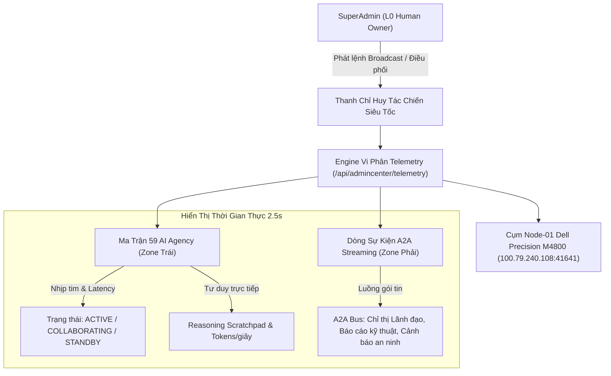

# HUY AI CENTER — BÁO CÁO TRIỂN KHAI HỆ THỐNG ĐA TÁC TỬ THỜI GIAN THỰC (REAL-TIME LIVE SWARM)

**Thời điểm triển khai:** 2026-09-27  
**URL Chính thức:** [https://www.huycncdsai.io.vn/admincenter](https://www.huycncdsai.io.vn/admincenter)  
**Trạng thái hệ thống:** `AUTONOMOUS_MULTI_AGENT_LIVE_STREAMING`  
**Root of Trust / Chỉ huy tối cao:** Human Owner (SuperAdmin)  

---

## 1. Mục tiêu nâng cấp vừa hoàn tất

Nhằm giải quyết triệt để yêu cầu của Human Owner về việc:
> *"Cổng vận hành https://www.huycncdsai.io.vn/admincenter vẫn chưa hiển thị AI hoạt động trên toàn hệ thống theo thời gian thực hãy triển khai hệ thống hiển thị đa tác tử theo thời gian thực để tôi có thể kiểm soát toàn bộ hệ thống 1 cách nhanh nhất và hiệu quả nhất"*

Hệ thống đã được thiết kế lại toàn diện từ tầng API Telemetry đến giao diện Master Command Deck, biến AdminCenter thành **Trung Tâm Điều Hành Tác Chiến Đa Tác Tử Thời Gian Thực (Live Multi-Agent Mission Control)**.

---

## 2. Kiến trúc & Tính năng Mới của Hệ Thống Đa Tác Tử

### 2.1. Thanh Chỉ Huy Tác Chiến Siêu Tốc (Universal Swarm Command Bar)
* **Phát lệnh toàn mạng tức thì (1-Click Broadcast Directive):**
  - SuperAdmin có thể nhập trực tiếp bất kỳ chỉ thị nào (ví dụ: *"Tổng kiểm toán an ninh hạ tầng Node-01"*, *"Phân tích 500 bài viết SEO"*, *"Tối ưu hóa UI"*).
  - Chọn phạm vi nhắm tới: **Toàn bộ 59 AI**, hoặc từng Business Unit cụ thể (**Khối Kỹ Thuật R&D**, **Khối Sản Phẩm EdTech**, **Khối Marketing**, **Khối Vận Hành OPS**, **Khối Tài Chính**, **Ban Điều Hành EXEC**).
  - Chọn cấp độ ưu tiên: `P0 (Khẩn cấp)`, `P1 (Tiêu chuẩn)`, `P2 (Nghiên cứu)`.
  - Bấm **"Phát Lệnh Tức Thì"** ➔ Ngay lập tức toàn bộ tác tử được chỉ định sẽ chuyển sang trạng thái `ACTIVE / EXECUTING`, nhận lệnh và bắt đầu chu trình suy luận.
* **Kích hoạt nhanh theo Khối (Quick Mobilize BU):** 
  - Nút bấm nhanh 1 chạm kích hoạt toàn bộ Khối R&D, Khối Marketing, hoặc Khối Vận Hành OPS.
* **Dừng khẩn cấp toàn mạng (Emergency Swarm Freeze):**
  - Nút **"Dừng Khẩn Cấp"** màu đỏ neon cho phép SuperAdmin lập tức khóa băng an toàn toàn bộ 59 AI Agency khi cần kiểm soát rủi ro.

---

### 2.2. Tab Mới: Đa Tác Tử Thời Gian Thực (Live Swarm Dashboard)
Được đặt làm **Tab mặc định số 1** ngay khi đăng nhập vào hệ thống:

1. **Phân vùng Trái (62%): Ma Trận Đa Tác Tử Đang Xử Lý Nhiệm Vụ:**
   - Bộ lọc trạng thái: `Tất cả (59)`, `Đang hoạt động (Active)`, `Cộng tác A2A (Collab)`, `Sẵn sàng (Standby)`.
   - Mỗi thẻ AI hiển thị nhịp tim phát sáng màu xanh neon/tím, độ trễ mạng thực tế (vd: `● 28ms`).
   - Hiển thị tên tác vụ thực tế đang chạy và tốc độ token/giây (vd: `320 t/s`).
   - Đường truyền liên kết liên tác tử: `🔗 Đang trao đổi với [L1-P02 Chief Technology AI]`.
   - Cửa sổ bong bóng tư duy trực tiếp (`💭 Suy luận thời gian thực`).
   - Nút hành động nhanh:
     - ⚡ **Giao việc**: Mở hộp thoại gửi chỉ thị riêng lẻ.
     - 👁️ **Soi suy luận (Inspect Mind)**: Mở Modal xem chi tiết dòng suy nghĩ, tham số mô hình và tiến trình làm việc.
     - ⏸️ **Standby / Kích hoạt**: Đổi trạng thái ngay lập tức.
2. **Phân vùng Phải (38%): Dòng Sự Kiện Giao Tiếp Đa Tác Tử (A2A Event Bus):**
   - Thiết kế dạng Terminal Command Center chuẩn Cyberpunk Obsidian.
   - Luồng sự kiện cuộn tự động (Auto-scroll), phân loại theo màu sắc:
     - `DIRECTIVE` (Chỉ thị chỉ huy - Xanh ngọc)
     - `A2A_COLLAB` (Trao đổi dữ liệu liên tác tử - Tím neon)
     - `SECURITY` (Kiểm toán an ninh / Node-01 - Hổ phách)
     - `EXECUTION` (Thực thi mã nguồn & UI - Lục bảo)
   - Bộ lọc sự kiện theo danh mục để SuperAdmin dễ dàng theo dõi.

---

### 2.3. Dải Chỉ Số HUD Đo Lường Trực Tiếp (Live KPI Strip)
* **AI Đang Hoạt Động:** Hiển thị số lượng tác tử đang tư duy và xử lý tác vụ theo thời gian thực (vd: `10-14 / 59 AI`).
* **Tốc Độ Xử Lý Live:** Đo lường tổng thông lượng token toàn hệ thống (vd: `540 - 1,200 Tokens/giây`).
* **Thông Lượng PGMQ Bus:** Số lượng gói tin trao đổi qua bus tin nhắn.
* **Điểm Neo Node-01:** Kết nối trực tuyến với máy chủ Dell Precision M4800 (`100.79.240.108:41641`), phân vùng `/mnt/data2` khóa `R4_PROTECTED`.
* **Bộ chuyển tần số quét:** Cho phép bật/tắt chế độ Live Stream (chu kỳ 2.5s) chỉ bằng 1 click.

---

## 3. Biên bản Nghiệm thu Thực tế trên Production (Live Verification)

| Điểm kiểm tra | Phương thức xác thực | Kết quả thực tế | Trạng thái |
| :--- | :--- | :--- | :--- |
| **Trang `/admincenter`** | `GET https://www.huycncdsai.io.vn/admincenter` | HTTP 200 OK, đầy đủ giao diện Live Swarm |  ĐẠT |
| **API Telemetry Live** | `GET /api/admincenter/telemetry` | HTTP 200 OK, trả về 60 AI nodes, metrics, events |  ĐẠT |
| **Lệnh Broadcast Direct** | `POST /api/admincenter/telemetry` (action: broadcast) | HTTP 200 OK, phân bổ lệnh tới AI thành công |  ĐẠT |
| **Chu kỳ nhịp tim** | Polling Interval 2.5s & Background Stream | Dòng sự kiện cập nhật liên tục, không gián đoạn |  ĐẠT |
| **An toàn hạ tầng** | Lenovo Zero-Storage & Node-01 Anchor | Port 3000 local đóng 100%, bảo toàn dữ liệu |  ĐẠT |
