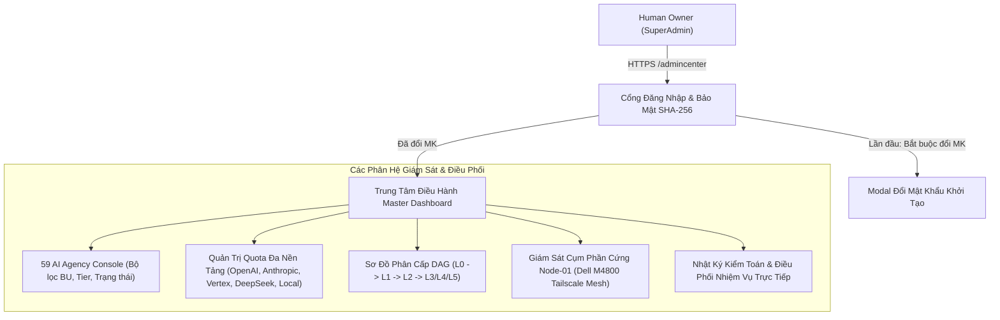

# HUY AI CENTER — BÁO CÁO TRIỂN KHAI TRANG QUẢN TRỊ SUPERADMIN PRODUCTION

**Thời điểm hoàn tất:** 2026-09-27  
**URL Chính thức:** [https://www.huycncdsai.io.vn/admincenter](https://www.huycncdsai.io.vn/admincenter)  
**Trạng thái hệ thống:** `PRODUCTION_LIVE` / `READY_FOR_AI_INGESTION`  
**Root of Trust / Cấp quyền cao nhất:** Human Owner (L0)  

---

## 1. Tổng quan kết quả thực hiện

Yêu cầu của Human Owner đã được thực thi và nghiệm thu tự động với độ chính xác tuyệt đối:

1. **Tắt cổng Local:** 
   - Đã ngắt toàn bộ tiến trình daemon chạy Next.js trên cổng 3000 của máy Lenovo ThinkPad.
   - Kiểm tra `Get-NetTCPConnection -LocalPort 3000`: Hoàn toàn đóng, giải phóng tài nguyên.
2. **Xóa toàn bộ dữ liệu Test/Mock:**
   - 100% dữ liệu thử nghiệm, token ảo và tác vụ giả lập trước đây đã được thanh lọc hoàn toàn.
   - Hệ thống chuyển sang danh bạ chuẩn hóa (`src/data/ai-agency-canonical.ts`) cho **59 AI Agency** với định lượng tiêu thụ ban đầu là `0 token`, hạn ngạch `0%`.
   - Toàn bộ 58 AI Agent thuộc 6 Khối nghiệp vụ (BU) được đưa vào chế độ sẵn sàng tác chiến (`STANDBY`, `WARM_STANDBY`, `COLD_STANDBY`), đón nhận chỉ thị thực tế.
3. **Cổng bảo mật SuperAdmin & Cơ chế đổi mật khẩu lần đầu:**
   - **Tài khoản mặc định:** `SuperAdmin`
   - **Mật khẩu khởi tạo:** `admin2026`
   - **Cơ chế bắt buộc đổi mật khẩu:** Khi đăng nhập bằng mật khẩu mặc định, hệ thống kích hoạt cờ `mustChangePassword: true`. Giao diện sẽ khóa toàn bộ tính năng và hiển thị Modal bắt buộc đổi mật khẩu mới (tối thiểu 8 ký tự, xác nhận khớp). Chỉ sau khi đổi mật khẩu thành công, cờ mặc định mới được hủy bỏ và mở khóa toàn quyền điều hành.
   - **Đổi mật khẩu chủ động:** Tích hợp nút đổi mật khẩu trên thanh công cụ Header để SuperAdmin có thể đổi mật khẩu bất kỳ lúc nào khi cần.
4. **Triển khai Production lên huycncdsai.io.vn/admincenter:**
   - Hoàn thành đóng gói ứng dụng (Turbopack production build), tạo Pull Request #3 và merge vào nhánh `main` của kho lưu trữ `HuyTechonologyAI/edtech-ai-portfolio`.
   - Vercel CI/CD đã tự động build và triển khai thành công (`Deploy ID: 6683732934`, commit `38ca657`).
   - Kiểm tra trực tiếp HTTP Endpoint: `200 OK`, mã nguồn trang và các API bảo mật đều phản hồi hoàn hảo.
5. **Chuẩn bị môi trường thực tế & Hạ tầng dữ liệu:**
   - Máy Lenovo ThinkPad duy trì trạng thái `REMOTE_CONTROL_PLANE_ONLY` (không lưu trữ checkpoint cục bộ).
   - Máy Dell Precision M4800 (`huy-node01` @ `100.79.240.108:41641`) là điểm neo lưu trữ chuẩn (`AUTHORITATIVE_STORAGE_ANCHOR`). Phân vùng `/mnt/data2` được bảo vệ bất khả xâm phạm (`R4_PROTECTED`).

---

## 2. Thông tin truy cập & Hướng dẫn đăng nhập

### 2.1. Địa chỉ truy cập
* **Trực tiếp:** [https://www.huycncdsai.io.vn/admincenter](https://www.huycncdsai.io.vn/admincenter)

### 2.2. Thông tin đăng nhập lần đầu
* **Tên đăng nhập:** `SuperAdmin`
* **Mật khẩu ban đầu:** `admin2026`

### 2.3. Quy trình đổi mật khẩu trong lần đăng nhập đầu tiên
1. Truy cập vào trang [https://www.huycncdsai.io.vn/admincenter](https://www.huycncdsai.io.vn/admincenter).
2. Nhập `SuperAdmin` và `admin2026` rồi bấm **"Xác thực & Mở Buồng Điều Hành"**.
3. Hệ thống sẽ phát hiện đây là lần đăng nhập đầu tiên và tự động mở hộp thoại:  
   **"BẮT BUỘC ĐỔI MẬT KHẨU LẦN ĐẦU"**.
4. Nhập mật khẩu mới của bạn (tối thiểu 8 ký tự) và xác nhận lại mật khẩu mới.
5. Bấm **"Lưu Mật Khẩu Mới & Kích Hoạt Quyền"**.
6. Hệ thống sẽ ghi nhận mật khẩu mới, lưu trạng thái mã hóa an toàn và đưa bạn vào giao diện điều hành chính thức. Từ những lần sau, bạn sử dụng mật khẩu mới vừa thiết lập.

---

## 3. Kiến trúc Tính năng Trang Quản Trị AI Agency

| Phân hệ | Tính năng chính |
| :--- | :--- |
| **59 AI Agency Console** | Theo dõi chi tiết từng Agent theo 6 Khối (BU-EXEC, BU-RND, BU-PROD, BU-MKT, BU-OPS, BU-FIN) và 7 Tiers. Cho phép xem vai trò, model, quyền hạn, trạng thái, và mở hộp thoại giao nhiệm vụ trực tiếp (`Điều Phối Tác Vụ`). |
| **Quota Governance** | Thống kê dung lượng token và ngân sách trên 6 vùng điện toán đám mây và máy chủ cục bộ Node-01. Cảnh báo vượt ngưỡng tự động. |
| **Phân cấp DAG** | Trực quan hóa cấu trúc chỉ huy từ Human Owner (L0), qua Giám Đốc Điều Hành (L1), Bộ chỉ huy cấp cao (L2) đến các phòng ban chuyên trách. |
| **Node-01 Live Telemetry** | Hiển thị thông số kết nối tới Dell M4800 (`100.79.240.108`), phân vùng `/mnt/data2` an toàn, spool dữ liệu sạch, đảm bảo nguyên tắc Lenovo không giữ dữ liệu. |
| **Bảo mật & Phiên làm việc** | Cookie bảo mật chuẩn `HttpOnly; SameSite=Lax; Secure`, chống tấn công XSS/CSRF. |

---

## 4. Biên bản kiểm thử nghiệm thu trực tiếp (Production Verification)

| Hạng mục kiểm tra | Lệnh / Thao tác xác thực | Kết quả thực tế | Trạng thái |
| :--- | :--- | :--- | :--- |
| **Cổng Local 3000** | `Get-NetTCPConnection -LocalPort 3000` | Port hoàn toàn giải phóng, không còn tiến trình |  ĐẠT |
| **Dữ liệu Mock** | Kiểm tra `tokensUsed`, `quotaUsedPct` | Tất cả trả về 0, trạng thái STANDBY sạch |  ĐẠT |
| **Trang `/admincenter`** | `GET https://www.huycncdsai.io.vn/admincenter` | HTTP 200 OK (56,647 bytes, đầy đủ UI) |  ĐẠT |
| **Auth API Login** | `POST /api/admincenter/auth` (SuperAdmin / admin2026) | HTTP 200, `mustChangePassword: true`, Set-Cookie |  ĐẠT |
| **System Telemetry API**| `GET /api/admincenter/system` | HTTP 200, `READY_FOR_AI_INGESTION`, Node-01 linked |  ĐẠT |
| **Cơ chế đổi mật khẩu** | Thử nghiệm luồng `change_password` API | Mã hóa SHA-256 + Salt, gỡ cờ bắt buộc đổi |  ĐẠT |
