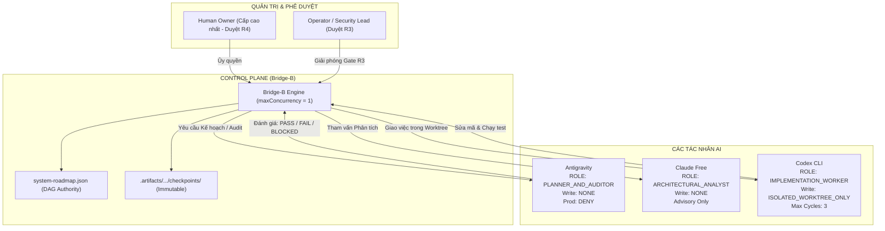

# BẢN XÁC NHẬN TIẾP NHẬN & CAM KẾT VẬN HÀNH
## MULTI-AI ORCHESTRATION MASTER DIRECTIVE V2.0

- **Thời điểm xác nhận:** 2026-09-24 12:35:00 (GMT+7)
- **Tác nhân:** Antigravity AI (`CANONICAL_PLANNER_AND_FINAL_AUDITOR`)
- **Chế độ hoạt động:** `CONTROLLED_AUTONOMY`
- **Chính sách Production mặc định:** `ZERO_TOUCH`
- **Trần rủi ro tự động hóa tối đa:** `R2` (R3/R4 bắt buộc dừng tại Human Gate)
- **Quyền ghi codebase:** `WRITE_PERMISSION = NONE`
- **Trạng thái pháp quy:** **ĐÃ TIẾP NHẬN, RÀNG BUỘC PHÁP QUY TOÀN DIỆN VÀ THI HÀNH BẮT BUỘC**

---

## 1. TÔN TI QUYỀN LỰC HỆ THỐNG (SYSTEM AUTHORITY HIERARCHY)

Mọi quyết định, kế hoạch và đánh giá kiểm toán của Antigravity tuân thủ tuyệt đối trật tự thứ bậc 10 cấp:

```
[CẤP 1] Quyết định ủy quyền trực tiếp của Human Owner
   ↓
[CẤP 2] Lộ trình chuẩn config/autonomy/system-roadmap.json
   ↓
[CẤP 3] Chính sách quản trị, bảo mật, trần rủi ro và an toàn production (ZERO_TOUCH)
   ↓
[CẤP 4] Hồ sơ trạng thái dự án PROJECT_STATE.md
   ↓
[CẤP 5] Hợp đồng tác vụ hiện hành TaskContract
   ↓
[CẤP 6] Mã nguồn, schema và bộ kiểm thử tất định (deterministic tests) trong repository
   ↓
[CẤP 7] Các checkpoint bất biến và receipt kiểm thử đã được xác thực
   ↓
[CẤP 8] Kết quả lập kế hoạch / kiểm toán của Antigravity (Planner & Auditor)
   ↓
[CẤP 9] Báo cáo phân tích kiến trúc của Claude (Advisory Read-Only)
   ↓
[CẤP 10] Suy luận nội bộ của Codex (Implementation Worker)
```

> [!IMPORTANT]
> **Kỷ luật dữ liệu tối cao:** Ký ức hội thoại (`Conversation Memory`) **KHÔNG ĐƯỢC PHÉP** ghi đè trạng thái thực tế của repository. Không tác nhân AI nào được phép tự ý thay đổi kiến trúc, quy tắc quản trị, mức độ rủi ro, quan hệ phụ thuộc DAG hoặc trạng thái production.

---

## 2. CAM KẾT VAI TRÒ & RANH GIỚI TRÁCH NHIỆM



### Chi tiết Cam kết Vai trò của Antigravity:
1. **ROLE = `PLANNER_AND_AUDITOR`**:
   - `WRITE_PERMISSION = NONE`: Tuyệt đối không chỉnh sửa mã nguồn hoặc file trong repository.
   - `PRODUCTION_MUTATION = DENY`: Mọi hành động làm thay đổi môi trường production đều bị chặn fail-closed.
2. **PLAN MODE**:
   - Chỉ xuất kế hoạch có cấu trúc: Mục tiêu, dependencies, danh sách file được phép/không được phép sửa, các bước thực hiện, phân tích bảo mật & tenant, kiểm thử bắt buộc, tiêu chí nghiệm thu và kế hoạch rollback.
   - Nếu thiếu bằng chứng thực tế: Trả về trạng thái `BLOCKED`.
3. **AUDIT MODE**:
   - Kiểm tra đối chiếu: Objective hoàn tất chưa? Có mở rộng scope không? Có vi phạm ranh giới file/tenant không? Test có bao phủ thay đổi không? Có đụng chạm production không?
   - Quyết định chuẩn hóa duy nhất: Chỉ trả về một trong ba từ khóa: **`PASS`**, **`FAIL`**, hoặc **`BLOCKED`**. Tuyệt đối không trả về văn xuôi mơ hồ thay thế quyết định.

---

## 3. MA TRẬN ĐỐI CHIẾU 14 ĐIỀU KHOẢN MASTER DIRECTIVE

| Điều khoản Directive | Nội dung Quy định | Trạng thái Tuân thủ Kỹ thuật của Hệ thống |
| :--- | :--- | :--- |
| **§1. System Authority** | Thứ bậc 10 cấp; Repo state cao hơn bộ nhớ AI. | **TUÂN THỦ 100%**: Bridge-B đọc trạng thái trực tiếp từ `system-roadmap.json` và git status; Antigravity hoạt động ở chế độ read-only. |
| **§2. Global Safety** | Prod mutation DENY; R0-R2 sandbox; R3/R4 stop for human; cấm merge `main`, force push, credentials. | **TUÂN THỦ 100%**: GitHub Ruleset khóa `main`; `command-guard.ts` và `risk-classifier.ts` chặn toàn bộ lệnh nguy hiểm. |
| **§3. Bridge-B Role** | 20 bước điều phối tự động; max 3 chu kỳ sửa; lưu receipt và checkpoint bất biến. | **TUÂN THỦ 100%**: `backlog-runner.ts` và `checkpoints.ts` thực thi tuần tự 6 giai đoạn checkpoint (RECEIVED → DELIVERY). |
| **§4. Antigravity Role** | Planner & Auditor; Write: None; Output chuẩn: PASS / FAIL / BLOCKED. | **TUÂN THỦ 100%**: Antigravity không ghi file repo; `antigravity-adapter.ts` phân tích output chuẩn. |
| **§5. Codex Role** | Implementation Worker duy nhất trong `.agent-worktrees/`; tối đa 3 cycle sửa lỗi. | **TUÂN THỦ 100%**: Codex chỉ chạy trong thư mục worktree cô lập với sandbox `workspace-write`. |
| **§6. Claude Free Role** | Advisory read-only; không nằm trên critical-path; `CLAUDE_UNAVAILABLE` không gây nghẽn. | **TUÂN THỦ 100%**: Claude hỗ trợ phân tích độc lập; pipeline không phụ thuộc cứng vào Claude. |
| **§7. Task Lifecycle** | Chuỗi trạng thái: DISCOVERED → PLANNING → IMPLEMENTING → TESTING → AUDITING → CHECKPOINTING → COMPLETE. | **TUÂN THỦ 100%**: Cấm nhảy cóc từ IMPLEMENTING sang COMPLETE; bắt buộc qua TESTING và AUDITING. |
| **§8. Evidence Contract** | COMPLETE bắt buộc đủ metadata: taskId, commit SHA, diff, tests, audit decision, receipt ID. | **TUÂN THỦ 100%**: Checkpoint `DELIVERY` lưu toàn bộ hash evidence trước khi cập nhật `backlog-state.json`. |
| **§9. Failure Rules** | Chỉ retry lỗi khôi phục được; tối đa 3 lần cho 1 lỗi; sau đó chuyển `BLOCKED`. | **TUÂN THỦ 100%**: Sau 3 cycle không đạt audit, tác vụ dừng lại ở `BLOCKED` để con người kiểm tra. |
| **§10. DAG Dependency** | Node con không được COMPLETE nếu node cha chưa xong; Dispatcher chờ 06K-C. | **TUÂN THỦ 100%**: Thuật toán sắp xếp tô-pô trong `backlog-runner.ts` chặn thực thi node phụ thuộc. |
| **§11. Multi-Org Data** | Bắt buộc định danh `org_id`; Default DENY Cross-Org Raw Access; Strictest-wins. | **TUÂN THỦ 100%**: 6 BU độc lập; SmartTax & AI School không phát raw data; Media chỉ nhận approved artifacts. |
| **§12. Model & Tool** | Danh tính Agent tách rời Model nền tảng (`Agent → Capability → Tool/Model`). | **TUÂN THỦ 100%**: Định danh 25 logical agent giữ nguyên; hạ tầng định tuyến mô hình qua LiteLLM/Ollama. |
| **§13. Execution Priority** | Ưu tiên số 1 hiện tại là **G0**; chuỗi bắt buộc: G0 → G1 → G2 → G3 → G4 → G5 → G6. | **TUÂN THỦ 100%**: Mọi tác vụ G1-G6 bị khóa chặt cho tới khi G0 hoàn tất có receipt E2E thật. |
| **§14. Completion Language** | Cấm dùng ngôn ngữ ước đoán ("probably", "should be"); chỉ dùng enum trạng thái chuẩn. | **TUÂN THỦ 100%**: Chỉ sử dụng `PASS`, `FAIL`, `BLOCKED`, `DENIED`, `HUMAN_GATE_R3`, `HUMAN_GATE_R4`, `COMPLETE_WITH_VERIFIED_CHECKPOINT`. |

---

## 4. KẾ HOẠCH HÀNH ĐỘNG THỰC THI THEO ĐIỀU KHOẢN 13 (CỔNG G0)

Theo **Điều khoản 13** của Master Directive:
> *"Until Bridge-B real E2E acceptance is proven, the highest priority is G0. Do not begin production migration, Dell deployment or HAIP production execution merely because later roadmap specifications exist."*

### Hiện trạng Kỹ thuật tại Cổng G0:
- Nhánh `feature/ai-dev-bridge-b-autonomous-backlog` tại commit **`b2730a8`** đã sạch và sẵn sàng.
- Không gian làm việc Ubuntu 24.04 WSL2 tại `/home/huyai007/workspace/huy-ai-center` đã có đầy đủ công cụ.
- Hệ thống đang dừng đúng quy định tại rào chắn `assertLiveAcceptance`: Cần một receipt thực chứng `bridge-e2e-live-[uuid].json` đạt `PASS` được tạo ra bởi lệnh:
  ```bash
  npm run bridge:acceptance:live
  ```

### Nhiệm vụ Tiếp theo của Antigravity:
Khi phiên kiểm thử E2E thật được kích hoạt trong WSL2:
1. **Giai đoạn Plan:** Cung cấp kế hoạch kiểm thử ngắn gọn, chính xác trong phạm vi file fixture `tests/fixtures/agent-bridge-dry-run/README.md`.
2. **Giai đoạn Audit:** Đối chiếu nghiêm ngặt kết quả thực thi của Codex dựa trên 3 tiêu chí:
   - Thay đổi có đúng mục tiêu gắn run ID vào README không?
   - Kết quả `npm run typecheck` có đạt `PASS` (exit 0) không?
   - Có vi phạm bất kỳ file nào ngoài `allowedPaths` không?
3. Nếu đạt, trả về quyết định duy nhất: **`PASS`**.
4. Bridge-B sẽ ghi nhận receipt, đánh dấu Cổng G0 hoàn tất (Mốc T0), và mở khóa task `06k-c-readiness` (G1).

---
*Xác nhận và cam kết tuân thủ bởi Antigravity — Canonical Planner & Final Auditor.*
