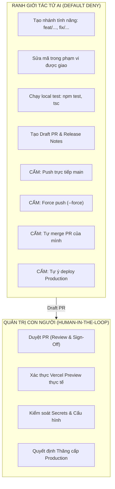

# TỔNG KẾT QUẢN TRỊ SAU PHÁT HÀNH & KỶ LUẬT MÃ NGUỒN — PHASE 06J-UX-D.1

**Dự án:** HUY AI AGENCY GROUP V2.0  
**Thương hiệu chủ quản:** HUY TECHNOLOGY AI GROUP  
**Domain Sản xuất:** [https://www.huycncdsai.io.vn/](https://www.huycncdsai.io.vn/)  
**Repository:** `HuyTechonologyAI/edtech-ai-portfolio`  
**Thời điểm thực hiện:** `2026-09-22T09:15:00+07:00`  
**Trạng thái:** **PASS**  

---

## 1. Nguồn Chân Lý Mã Nguồn Sản Xuất (Production Source of Truth)

- **Production Branch:** `main` (tại `e8a24c6`)
- **Release Commit SHA (Được ghi nhận tại Cutover):** `2fcf4823e8c6649a5be3813cf9210ee2063932f9`
- **Previous Baseline SHA:** `7f3dfdf7f5c0fe59381da431bff7bc473082f5bc`
- **Merge Cutover Commit SHA:** `32d096ab22e48f0581da0334c429f6d1884442d6`
- **Rollback Tag:** `pre-corporate-v2-cutover-2026-09-21` (Phân giải chính xác về `7f3dfdf...`)
- **Production Release Tag:** `corporate-v2.0.0` (Đã tạo và đẩy lên GitHub origin)
- **Production Deployment ID:** `sin1::59jds-1790004036237-c1ef45dc79ee` (`P3XZ89gLPxorWWakjwJikXDCQqDA`)

---

## 2. Hệ Thống Kiểm Soát Nhánh & Ranh Giới Tác Tử AI

---

## 3. Bộ Văn Bản Quản Trị Đã Ban Hành (`docs/governance/`)

1. [Quy trình Phát hành Chuẩn tắc (V2_RELEASE_GOVERNANCE.md)](file:///C:/Users/Admin/.gemini/antigravity/scratch/huy-ai-center/docs/governance/V2_RELEASE_GOVERNANCE.md)
2. [Chính sách Nhánh Git & Bảo vệ main (V2_GIT_BRANCH_POLICY.md)](file:///C:/Users/Admin/.gemini/antigravity/scratch/huy-ai-center/docs/governance/V2_GIT_BRANCH_POLICY.md)
3. [Ranh giới Thao tác Tác tử AI (V2_AI_AGENT_CODE_POLICY.md)](file:///C:/Users/Admin/.gemini/antigravity/scratch/huy-ai-center/docs/governance/V2_AI_AGENT_CODE_POLICY.md)
4. [Quy trình Ứng phó Sự cố Sản xuất SEV 1-4 (V2_PRODUCTION_INCIDENT_POLICY.md)](file:///C:/Users/Admin/.gemini/antigravity/scratch/huy-ai-center/docs/governance/V2_PRODUCTION_INCIDENT_POLICY.md)
5. [Tiêu chuẩn & Thứ tự Phục hồi Rollback (V2_ROLLBACK_STANDARD.md)](file:///C:/Users/Admin/.gemini/antigravity/scratch/huy-ai-center/docs/governance/V2_ROLLBACK_STANDARD.md)
6. [Ranh giới Môi trường & Bộ Header An ninh (V2_ENVIRONMENT_BOUNDARIES.md)](file:///C:/Users/Admin/.gemini/antigravity/scratch/huy-ai-center/docs/governance/V2_ENVIRONMENT_BOUNDARIES.md)

---

## 4. Biểu Mẫu Chuẩn Hóa Trên GitHub

- [Pull Request Template](file:///C:/Users/Admin/.gemini/antigravity/scratch/edtech-ai-portfolio/.github/pull_request_template.md)
- [Production Incident Issue Template](file:///C:/Users/Admin/.gemini/antigravity/scratch/edtech-ai-portfolio/.github/ISSUE_TEMPLATE/production-incident.md)

---

## 5. Kết Quả Kiểm Thử & Trạng Thái Hệ Thống

- **Monorepo Tests (`huy-ai-center`):** PASS (58/58 tests, 100%)
- **TypeScript Compile (`edtech-ai-portfolio`):** PASS (0 lỗi)
- **Next.js Production Build (`edtech-ai-portfolio`):** PASS (57/57 static & dynamic routes)
- **Production Domain (`https://www.huycncdsai.io.vn/`):** LIVE (HTTP 200 OK)
- **Thay đổi Cơ sở dữ liệu Supabase:** ZERO
- **Thay đổi Dispatcher / Hàng đợi / Node AI:** ZERO
